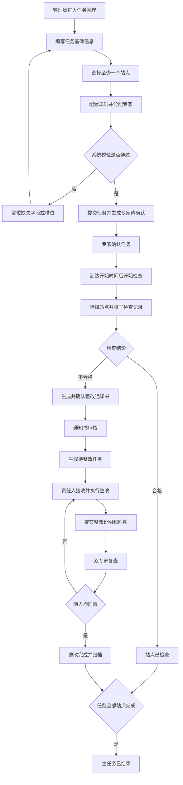
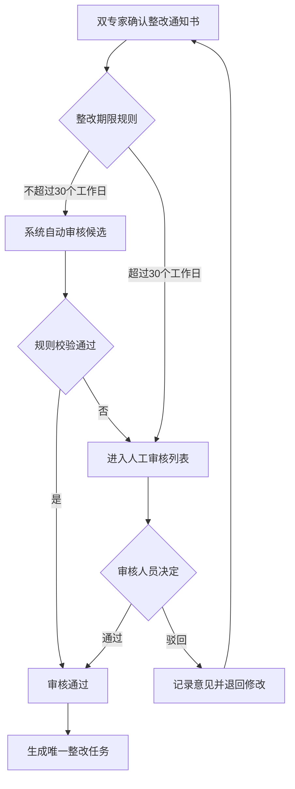
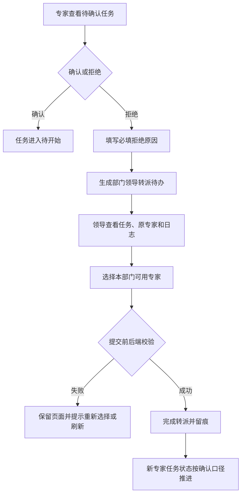
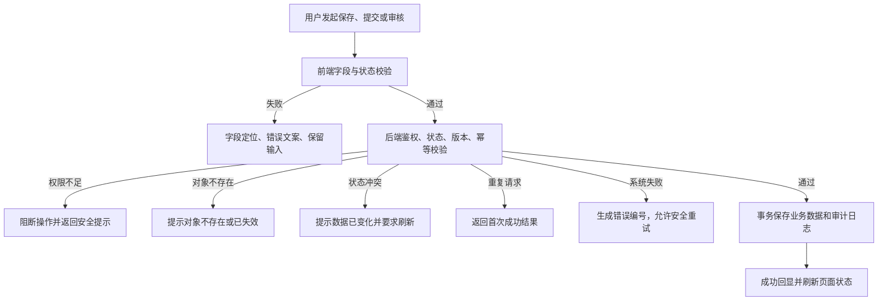
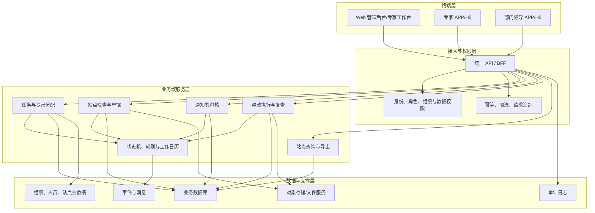

# 面积检查与整改闭环需求总文档

> 文档状态：评审稿 V1.0  
> 基线日期：2026-07-13  
> 当前基线：本仓库 `docs/` 与 `prototypes/rectification/` 现状  
> 页面目录（绝对路径）：`/Users/sears/Desktop/VibeWork/pm-prototype-center/prototypes/rectification`  
> 本文档（绝对路径）：`/Users/sears/Desktop/VibeWork/pm-prototype-center/docs/brief.md`

## 0. 文档使用说明

本文档同时包含两份核心交付内容：

1. 《功能规格说明书》：定义业务目标、用户与权限、页面信息架构、用户故事、业务流程、状态、校验、异常及验收条件。
2. 《系统建设方案》：定义产品架构、模块边界、核心交互、数据与状态协同、Ant Design 组件选型及建议的非功能指标。

口径标签：

- **已确认**：用户已明确，或当前仓库文档与页面实现一致。
- **当前原型口径**：当前 HTML 已呈现，但尚未获得正式业务确认。
- **默认假设/待确认**：为保证方案完整而提出，不作为最终业务规则。
- **默认假设，待研发评估**：建议的技术或性能指标，需研发、运维、安全共同评估。

---

# 第一部分 《功能规格说明书》

## 1. 功能定义与建设范围

### 1.1 功能定义

面积检查与整改系统用于组织年度或周期性面积检查任务，将站点选择、专家抽取和确认、现场检查、检查记录与实测复核、不合格整改通知书审核、整改执行、专家复查、归档查询串联为可追踪的业务闭环。

### 1.2 本期范围

| 模块 | 范围 | 终端/场景 |
| --- | --- | --- |
| 任务管理 | 任务查询、创建、编辑、站点选择、专家抽选、详情与进度 | Web 管理后台 |
| 专家任务 | 专家确认/拒绝、转派衔接、开始检查、检查录入与双人确认 | Web 专家工作台、专家 APP |
| 整改通知书审核 | 通知书查询、详情核对、通过/驳回 | Web 管理后台 |
| 整改执行 | 任务接收、计时、整改说明、附件提交、超期处理 | Web 整改工作台 |
| 专家复查 | 整改结果查看、双专家会签、通过归档或退回整改 | Web、专家 APP |
| 站点明细 | 组织筛选、多条件查询、站点详情、变化台账导出 | Web 管理后台 |
| 转派审核 | 专家拒绝后的本部门重新指派和过程留痕 | 部门领导 APP |

### 1.3 不在本次原型范围内

- 生产级登录、统一身份认证、组织主数据、消息中心和接口联调。
- 真实文件上传、电子签章、Office/PDF 导出、短信/推送。
- 数据库、任务调度器、工作日历、审计平台的生产实现。
- 统计驾驶舱和跨年度趋势分析。

上述能力如进入研发范围，应另行补充接口、数据、部署和安全设计。

## 2. 分层目标

### 2.1 业务目标

1. 建立从任务下发到整改归档的完整闭环，避免检查与整改结果散落在多个渠道。
2. 形成任务、站点、检查记录单、整改通知书、整改告知书和复查意见的关联链路。
3. 通过专家分配、双人确认、通知书审核和复查会签控制结果质量。
4. 对拒绝转派、超期整改、审核驳回和复查退回等异常分支可追踪、可复盘。

### 2.2 用户目标

| 用户 | 目标 |
| --- | --- |
| 业务管理员 | 快速创建任务、选择正确站点和专家，掌握整体进度并处理通知书审核。 |
| 检查专家 | 明确本人任务和待处理站点，在现场便捷查看资料、录入结果、完成确认与复查。 |
| 部门领导 | 对专家拒绝任务及时重新指派，保证任务不因人员原因停滞。 |
| 整改责任人 | 清楚整改要求、期限和附件要求，完成整改提交并跟踪复查结果。 |
| 管理部主任 | 只读掌握本部门检查、整改和超期情况。 |

### 2.3 平台、运营与风控目标

| 层级 | 目标 |
| --- | --- |
| 平台 | 统一状态口径、跨端数据来源和操作反馈，减少 PC 与 APP 数据不一致。 |
| 运营 | 支持按任务、年度、组织、站点、状态、时间查询，快速定位积压和超期对象。 |
| 风控 | 关键提交、审核、转派、退回、导出保留操作者、时间、前后值与原因；权限在前后端双重校验。 |

## 3. 默认假设与待确认边界

| 编号 | 事项 | 当前处理方式 | 标签 |
| --- | --- | --- | --- |
| A01 | 任务名称生成规则 | 允许人工填写，不强制“年份+周期+类型” | 默认假设/待确认 |
| A02 | 任务开始/结束时间 | 均必填，结束时间不得早于开始时间 | 默认假设/待确认 |
| A03 | 进行中任务编辑 | 仅允许调整专家；基础信息和站点锁定 | 当前原型口径，待确认 |
| A04 | 专家拒绝后的处理 | 由部门领导在本部门重新指派；新专家默认已确认 | 当前原型口径，待确认 |
| A05 | 检查记录单“不同意” | 当前页面仅记录意见并保持确认中；状态总表写为退回待修改，二者冲突 | 默认假设/待确认，实施前必须统一 |
| A06 | 整改通知书双人确认 | 填写人提交后自动同意，另一专家同意后生效 | 当前原型口径，待确认 |
| A07 | 整改期限审核 | 不超过 30 个工作日自动通过，超过 30 个工作日人工审核 | 默认假设/待确认 |
| A08 | 整改责任人 | 默认取站点所属片区所所长 | 默认假设/待确认 |
| A09 | 整改计时起点 | 通知书审核通过后生成待整改任务，责任人点击“接收”后开始计时 | 当前原型口径，待确认 |
| A10 | 第二复查专家 | 默认沿用原检查任务的另一名专家 | 默认假设/待确认 |
| A11 | 整改复查 | 双专家均同意才完成；任一不同意退回整改中 | 当前原型口径，待确认 |
| A12 | 整改通知单编号 | 由后端按组织+日期+流水号生成且唯一 | 默认假设/待确认 |
| A13 | 跨端同步 | PC、专家 APP、部门领导 APP 共享后端业务状态；原型的 localStorage/sessionStorage 不作为生产方案 | 默认假设/待确认 |
| A14 | 并发控制 | 记录单采用抢占锁，其他更新采用版本号乐观锁与幂等键 | 默认假设，待研发评估 |

## 4. 用户角色与权限

### 4.1 角色定义

| 角色 | 主要使用者 | 数据范围 | 核心职责 |
| --- | --- | --- | --- |
| 业务管理员 | 面积检查业务管理人员 | 默认全部任务和站点 | 创建任务、分配专家、查看进度、审核整改通知书 |
| 检查专家 | 被抽取或指派的现场专家 | 本人参与任务及其站点 | 确认任务、现场检查、填写/确认单据、整改复查 |
| 部门领导 | 专家所属部门领导 | 本部门专家及转派任务 | 审核专家拒绝并重新指派 |
| 整改责任人 | 片区所所长或指定整改人员 | 本人负责整改任务 | 接收、执行和提交整改 |
| 管理部主任 | 管理部管理人员 | 本管理部数据 | 只读查看检查和整改情况 |
| 系统服务 | 定时任务、规则引擎 | 授权业务范围 | 自动推进时间状态、生成任务、计算超期和留痕 |

### 4.2 复杂权限矩阵

| 业务对象/动作 | 业务管理员 | 检查专家 | 部门领导 | 整改责任人 | 管理部主任 | 权限差异与异常处理 |
| --- | --- | --- | --- | --- | --- | --- |
| 任务列表/详情 | 全量可见 | 仅本人任务 | 本部门转派相关只读 | 无或关联整改只读 | 本部门只读 | 越权访问返回无权限页，不泄露对象字段 |
| 新建任务 | 可创建、暂存、提交 | 无 | 无 | 无 | 无 | 后端校验组织与站点数据范围 |
| 编辑草稿/待开始 | 基础信息、站点、专家均可改 | 无 | 无 | 无 | 无 | 已被他人更新时提示刷新后重试 |
| 编辑进行中任务 | 仅专家分配可改 | 无 | 无 | 无 | 无 | 基础字段、站点和删除按钮禁用；后端同样拒绝修改 |
| 删除任务 | 草稿/待开始可删除 | 无 | 无 | 无 | 无 | 进行中/已结束禁用；建议二次确认并留痕 |
| 确认/拒绝任务 | 只读查看结果 | 待确认时可操作本人任务 | 无 | 无 | 只读 | 拒绝原因必填；重复确认按幂等处理 |
| 转派审核 | 可在 PC 查看结果；是否可代办待确认 | 无 | 本部门待处理任务可指派 | 无 | 只读 | 只能选择本部门可用专家；已处理按钮禁用 |
| 检查记录单填写 | 只读 | 被分配专家中抢占成功者可编辑 | 无 | 无 | 只读 | 另一专家只读；锁过期与释放规则待确认 |
| 检查记录单确认 | 只读 | 非填写专家可确认；填写人自动同意 | 无 | 无 | 只读 | 已完成后字段和按钮全部只读 |
| 实测复核 | 只读 | 本任务专家可上传照片并填面积 | 无 | 无 | 只读 | 非“实测”建筑不显示入口 |
| 整改通知书审核 | 待审核可通过/驳回 | 查看本人相关单据 | 无 | 只读整改要求 | 只读 | 自动审核和人工审核边界待确认 |
| 接收/提交整改 | 只读查看 | 只读/复查 | 无 | 本人待整改可接收，整改中/已超期可提交 | 只读 | 说明必填、附件必传；超期仍允许提交并保留标记 |
| 整改复查 | 只读结果 | 原任务两位专家可分别会签 | 无 | 只读结果 | 只读 | 任一不同意退回；不得代替另一专家操作 |
| 站点导出 | 全量或授权范围 | 本任务站点按需查看，不默认导出 | 无 | 无 | 本部门可导出待确认 | 导出需记录条件、数据范围、操作者和时间 |

### 4.3 字段、按钮与状态权限原则

1. 字段权限分为隐藏、脱敏只读、只读、可编辑四级；前端展示仅改善体验，后端必须重新鉴权。
2. 按钮权限由“角色权限 + 数据范围 + 对象状态 + 是否本人待办”共同决定。
3. 状态不匹配时按钮禁用并说明原因；直接调用接口仍返回明确业务错误码。
4. 对象不存在与无权访问统一避免暴露敏感信息，但审计日志应记录真实原因。

## 5. 页面目录、终端与上下游

> 下表所有路径均为绝对路径。预览页用于 PC 中嵌入移动端页面，standalone 页用于独立演示；生产建设时可合并为同一移动端路由。

| 模块/页面名称 | HTML 绝对路径 | 终端/使用场景 | 上游入口 | 下游页面或动作 |
| --- | --- | --- | --- | --- |
| 模块首页 | `/Users/sears/Desktop/VibeWork/pm-prototype-center/prototypes/rectification/index.html` | Web 管理后台 | 直接访问 | 任务管理、我的任务、审核、整改、站点明细、移动端预览 |
| 面积检查任务管理 | `/Users/sears/Desktop/VibeWork/pm-prototype-center/prototypes/rectification/task-list.html` | Web 管理后台 | 模块首页/左侧菜单 | 任务详情、新建/编辑、删除 |
| 面积检查任务详情 | `/Users/sears/Desktop/VibeWork/pm-prototype-center/prototypes/rectification/task-detail.html` | Web 管理后台 | 任务列表 | 站点详情、返回、导出 |
| 新建/编辑任务-基础信息 | `/Users/sears/Desktop/VibeWork/pm-prototype-center/prototypes/rectification/task-create.html` | Web 管理后台 | 任务列表 | 抽选专家、返回列表 |
| 新建/编辑任务-抽选专家 | `/Users/sears/Desktop/VibeWork/pm-prototype-center/prototypes/rectification/task-expert.html` | Web 管理后台 | 基础信息页 | 提交任务、上一步、返回列表 |
| 我的面积检查任务 | `/Users/sears/Desktop/VibeWork/pm-prototype-center/prototypes/rectification/my-task-list.html` | Web 专家工作台 | 左侧菜单 | 确认/拒绝、开始检查、查看详情、转派审核弹窗 |
| 开始检查 | `/Users/sears/Desktop/VibeWork/pm-prototype-center/prototypes/rectification/my-task-check.html` | Web 专家工作台 | 我的任务 | 检查记录单、整改通知单、实测复核、返回列表 |
| 整改通知书审核 | `/Users/sears/Desktop/VibeWork/pm-prototype-center/prototypes/rectification/review-notice.html` | Web 管理后台 | 左侧菜单/待办 | 审核弹窗、站点详情 |
| 整改任务列表 | `/Users/sears/Desktop/VibeWork/pm-prototype-center/prototypes/rectification/rectification-task.html` | Web 整改工作台 | 左侧菜单/通知书审核通过 | 接收、整改提交、整改详情 |
| 整改任务详情 | `/Users/sears/Desktop/VibeWork/pm-prototype-center/prototypes/rectification/rectification-detail.html` | Web 管理/专家/整改协作 | 整改任务列表 | 专家会签、返回列表 |
| 面积检查站点明细 | `/Users/sears/Desktop/VibeWork/pm-prototype-center/prototypes/rectification/site-detail-list.html` | Web 管理后台 | 左侧菜单 | 站点详情、全部/单站台账导出 |
| 站点详情 | `/Users/sears/Desktop/VibeWork/pm-prototype-center/prototypes/rectification/site-detail.html` | Web 管理后台 | 任务详情、审核列表、站点明细 | 普查详情弹窗、各业务单据只读查看 |
| 专家 APP 预览 | `/Users/sears/Desktop/VibeWork/pm-prototype-center/prototypes/rectification/expert-app-preview.html` | Web 演示容器 | 左侧菜单 | iframe 进入专家 APP |
| 专家 APP 工作台 | `/Users/sears/Desktop/VibeWork/pm-prototype-center/prototypes/rectification/expert-app.html` | 移动端 APP/H5 | APP 启动/预览页 | 面积检查任务、整改任务 |
| 专家 APP 任务列表 | `/Users/sears/Desktop/VibeWork/pm-prototype-center/prototypes/rectification/expert-app-task-list.html` | 移动端 APP/H5 | 工作台 | 任务确认、任务详情、整改站点详情 |
| 专家 APP 任务确认 | `/Users/sears/Desktop/VibeWork/pm-prototype-center/prototypes/rectification/expert-app-task-confirm.html` | 移动端 APP/H5 | 待确认任务 | 确认/拒绝并返回列表 |
| 专家 APP 任务详情 | `/Users/sears/Desktop/VibeWork/pm-prototype-center/prototypes/rectification/expert-app-task-detail.html` | 移动端 APP/H5 | 任务列表 | 站点列表 |
| 专家 APP 站点列表 | `/Users/sears/Desktop/VibeWork/pm-prototype-center/prototypes/rectification/expert-app-site-list.html` | 移动端 APP/H5 | 任务详情 | 站点详情 |
| 专家 APP 站点详情 | `/Users/sears/Desktop/VibeWork/pm-prototype-center/prototypes/rectification/expert-app-site-detail.html` | 移动端 APP/H5 | 站点列表/整改任务 | 楼栋详情、检查记录、复核/审核弹窗 |
| 专家 APP 楼栋详情 | `/Users/sears/Desktop/VibeWork/pm-prototype-center/prototypes/rectification/expert-app-building-detail.html` | 移动端 APP/H5 | 站点详情 | 返回站点、查看变更、上传复核材料 |
| 专家 APP 检查记录单 | `/Users/sears/Desktop/VibeWork/pm-prototype-center/prototypes/rectification/expert-app-check-record.html` | 移动端 APP/H5 | 站点详情 | 电子签名、提交后返回 |
| 专家 APP 电子签名 | `/Users/sears/Desktop/VibeWork/pm-prototype-center/prototypes/rectification/expert-app-signature.html` | 移动端 APP/H5 | 检查记录单 | 提交签字、返回记录单 |
| 专家 APP 单文件演示 | `/Users/sears/Desktop/VibeWork/pm-prototype-center/prototypes/rectification/expert-app-standalone.html` | 移动端独立演示 | 直接访问 | 文件内路由完成工作台、任务、站点和整改演示 |
| 部门领导 APP 预览 | `/Users/sears/Desktop/VibeWork/pm-prototype-center/prototypes/rectification/dept-leader-app-preview.html` | Web 演示容器 | 左侧菜单 | iframe 进入领导 APP |
| 部门领导 APP 单文件 | `/Users/sears/Desktop/VibeWork/pm-prototype-center/prototypes/rectification/dept-leader-app-standalone.html` | 移动端 APP/H5 | APP 启动/预览页 | 转派列表、审核指派、处理结果 |

## 6. 信息架构与页面区域规格

### 6.1 Web 管理后台与专家工作台

| 页面 | 页面区域 | 展示内容与关键字段 | 操作入口 | 动态展示/权限规则 | 与其他区域关系 |
| --- | --- | --- | --- | --- | --- |
| 模块首页 | 标题/导航区 | 系统名称、面积检查任务统计、功能卡片 | 点击卡片/左侧菜单 | 按角色隐藏无权限入口 | 卡片进入各业务列表 |
| 任务管理 | 标题与操作区 | 页面标题、任务总数 | 新建任务 | 仅业务管理员显示新建 | 驱动创建流程 |
| 任务管理 | 筛选区 | 计划名称、所属年度、任务状态 | 查询、重置 | 多条件叠加；空结果显示空态 | 控制任务表格和计数 |
| 任务管理 | 列表区 | 任务名称、周期、年度、专家确认、完成进度、状态、合格/不合格、创建/完成时间 | 详情、编辑、删除、分页 | 草稿/待开始可编辑删除；进行中仅编辑专家；已结束只读 | 进入详情或两步编辑页 |
| 任务管理 | 状态/反馈区 | 状态 Tag、进度数字、操作禁用原因 | hover/禁用提示 | 专家确认明细浮层当前待实现 | 与任务状态同步 |
| 任务详情 | 标题/概览区 | 任务名称、状态、计划、区域、负责人 | 返回、导出 | 草稿详情可限制为基础信息 | 汇总基础信息和统计 |
| 任务详情 | 进度/信息区 | 草稿→待开始→进行中→已结束步骤条；任务周期、站点、专家 | 查看站点详情 | 当前状态高亮；已结束只读 | 站点列表进入站点详情 |
| 新建任务 | 步骤/基础信息区 | 任务名称、开始时间、结束时间 | 输入、暂存 | 必填；结束不得早于开始 | 校验通过后开放下一步 |
| 新建任务 | 站点选择区 | 已选站点编码、名称、管理部、片区所、类型、地址 | 打开选择器、移除 | 至少 1 站；进行中编辑时全部锁定 | 决定专家分组范围 |
| 新建任务 | 站点选择弹窗 | 组织、片区所、类型、名称、普查/检查条件和候选表格 | 查询、重置、全选、确认 | 全选仅作用于当前筛选结果 | 回写已选站点区 |
| 新建任务 | 底部操作区 | 当前步骤和校验提示 | 取消、暂存、下一步 | 进行中编辑跳过已锁定字段校验 | 下一步进入专家抽选 |
| 抽选专家 | 规则设置区 | 年龄优先、检查间隔、管理部人数、专家库范围、全量开关、总数量 | 设置范围、抽取 | 设置范围/真实抽取算法待确认 | 生成候选池与管理部分组 |
| 抽选专家 | 分组与候选区 | 管理部槽位、专家姓名/类型/部门、待分配/已分配 | 搜索、Tab、选择、移除、添加 | 仅显示任务站点涉及的管理部；不可重复分配 | 分配进度控制提交按钮 |
| 抽选专家 | 专家选择弹窗 | 组织树、用户名、姓名、手机号、组织、年龄、最近检查时间 | 查询、单选、确认 | 仅可选数据范围内且可用专家 | 回填当前槽位 |
| 抽选专家 | 底部操作区 | 已分配 N/M、缺失提示 | 上一步、暂存、提交 | 全部必需槽位占满才可提交 | 成功后返回任务列表 |
| 我的任务 | 筛选/列表区 | 任务名称、年度、周期、状态、待处理站点 | 查询、重置、确认、拒绝、开始检查、详情 | 待确认显示确认/拒绝；待开始/进行中显示开始检查；已结束只读 | 进入检查或详情 |
| 我的任务 | 拒绝/转派区 | 拒绝原因、原专家、转派日志、候选专家 | 确认拒绝、审核指派 | 原因必填；审核仅对待转派且有权限角色显示 | 拒绝结果进入部门领导待办 |
| 开始检查 | 任务与站点区 | 任务周期、专家、进度；站点名称、地址、状态、面积等 | 站点 Tab、返回 | 站点状态决定内容与操作 | 选择站点驱动下方业务 Tab |
| 开始检查 | 业务内容区 | 普查明细、检查记录单、整改通知单、实测复核 | 填写、编辑、确认、上传、复核面积 | 合格隐藏整改通知单；仅“实测”建筑进入复核 | 检查结论驱动整改分支 |
| 开始检查 | 校验/确认区 | 检查项状态、问题提示、双专家确认表、操作时间线 | 同意/不同意 | 填写人自动同意；不同意后续规则存在口径冲突 | 决定单据完成或待修改 |
| 开始检查 | 结果反馈区 | Toast、错误提示、保存状态、误差超限 | 返回/继续处理 | 实测复核失焦自动保存；超限当前仅提示不阻断 | 刷新站点进度和状态 |
| 通知书审核 | 筛选/列表区 | 任务/站点、审核状态、通知书编号、期限、审核人/意见 | 查询、重置、详情、审核 | 仅待审核显示审核按钮 | 详情进入站点全貌 |
| 通知书审核 | 审核弹窗 | 通知书详情、审核结果、审核意见 | 通过、驳回、取消 | 审核结果必选；驳回意见是否必填待确认 | 成功更新列表状态并生成/退回后续对象 |
| 整改任务 | 筛选/列表区 | 任务、站点、整改人、组织、状态、截止时间、超期、节点 | 查询、重置、详情、接收、整改 | 待整改可接收；整改中/已超期可整改；其他状态只读 | 进入详情或提交弹窗 |
| 整改任务 | 接收/整改弹窗 | 截止时间、整改情况、整改告知书附件 | 确认接收、保存整改 | 接收后计时；说明必填、附件必传；超期仍可提交 | 提交后进入专家审核 |
| 整改详情 | 标题/基础信息区 | 站点、用户编码、地址、组织、联系人、状态 | 返回、专家审核 | 待专家审核且当前专家有权时显示审核 | 关联各业务单据 Tab |
| 整改详情 | 详情/会签区 | 普查、面积对比、检查记录、通知书、告知书、两位专家意见 | 查看明细、同意/不同意 | 两位专家独立操作；已完成全部只读 | 会签结果推进完成或退回 |
| 站点明细 | 组织/筛选区 | 管理部→片区所树；站点、任务、检查/整改状态和时间 | 勾选、查询、重置 | 左树与顶部条件叠加；节点数量动态口径待确认 | 控制右侧列表 |
| 站点明细 | 列表/导出区 | 站点编码、名称、组织、地址、普查、专家、结果、完成时间 | 详情、明细导出、全部导出 | 自管站显示单站明细导出 | 详情进入站点全貌，导出形成台账 |
| 站点详情 | 概览/Tab区 | 基础信息、面积变化、普查明细、照片、检查记录、通知单、告知书 | Tab、普查详情、返回 | 当前以只读为主；缺失资料显示空态 | 聚合任务、检查、整改数据 |

### 6.2 专家 APP/H5

| 页面 | 页面区域 | 展示内容与关键字段 | 操作入口 | 动态展示/权限规则 | 关系 |
| --- | --- | --- | --- | --- | --- |
| 专家 APP 预览 | 模型机/说明区 | iframe、页面定位、状态口径、建设边界 | 底部导航 | 仅用于演示，不承载生产业务 | 嵌入工作台 |
| 工作台 | 标题/卡片/底栏 | 专家姓名、面积检查任务数、整改任务数 | 任务卡片、首页/任务/我的 | 数量按本人待办动态更新 | 进入任务列表 |
| 任务列表 | 搜索/Segment/卡片 | 任务或站点名称、状态、周期、待办数量 | 搜索、状态切换、确认、查看整改 | 面积检查与整改使用不同状态集合 | 进入确认或详情 |
| 任务确认 | 标题/任务信息/须知/操作区 | 名称、年度、周期、管理部、站点数、确认须知 | 确认、拒绝 | 仅待确认本人任务可操作；拒绝原因必填 | 结果回写列表并产生转派待办 |
| 任务详情 | 状态/信息/站点区 | 任务或整改信息、站点卡片及状态 | 点击站点、返回 | 按任务类型和状态展示按钮 | 进入站点列表 |
| 站点列表 | 搜索/卡片区 | 站点名称、编码、地址、组织、检查状态 | 开始检查、查看详情 | 按站点状态切换按钮 | 进入站点详情 |
| 站点详情 | 状态卡/业务 Tab | 基础信息、面积汇总、建筑物、图片、检查记录、整改通知单/告知书 | 楼栋详情、复核、审核 | 不合格才显示整改通知单；“实测”建筑才可复核 | 聚合站点全貌和执行入口 |
| 楼栋详情 | 统计/Tab/复核区 | 原/现面积、变化量/率、基础信息、房间变更 | Tab、上传照片、填复查面积 | 仅相关专家可提交；面积必须大于 0 | 返回站点并更新复核标识 |
| 检查记录单 | 检查项/结论/签名/操作区 | 7 项检查结果、异常子项、描述、结论、签名 | 选择、填写、签名、提交 | 结论和全部检查项必填；选“否”展开异常子项 | 提交驱动站点合格/不合格 |
| 电子签名 | 画布/操作区 | 当前签名、手写轨迹 | 清除、提交 | 空签名不得提交；签名人与登录人一致 | 返回记录单并显示已签 |
| APP 单文件演示 | 内部路由区 | 工作台、任务、站点、整改的复刻视图 | 文件内导航 | 仅演示，规则应与多页面版一致 | 不作为独立业务数据源 |

### 6.3 部门领导 APP/H5

| 页面 | 页面区域 | 展示内容与关键字段 | 操作入口 | 动态展示/权限规则 | 关系 |
| --- | --- | --- | --- | --- | --- |
| 领导 APP 预览 | 模型机/说明区 | iframe 与业务说明 | 预览导航 | 仅用于演示 | 嵌入 standalone |
| 转派审核 | 工作台/Segment/卡片 | 全部、待处理、已处理；任务摘要、原专家、拒绝原因、处理结果 | 查看、审核指派 | 仅本部门待处理显示按钮 | 进入审核指派 |
| 审核指派 | 摘要/原专家/日志/候选区 | 任务、周期、管理部、站点数、拒绝原因、转派日志、候选专家 | 选择专家、确认转派 | 只能选本部门可用专家；未选择时按钮禁用 | 成功回列表并更新 PC/专家端状态 |

### 6.4 按页面维度的详细规格与交互逻辑

> 本节以实际 HTML 页面为最小单元。每页均独立说明页面定位、使用者、区域、操作、动态规则和上下游交互；开发与评审时应按本节逐页核对。

#### 6.4.1 模块首页（index.html）

- **绝对路径**：`/Users/sears/Desktop/VibeWork/pm-prototype-center/prototypes/rectification/index.html`
- **终端/场景**：Web 管理后台模块入口。
- **主要使用者**：业务管理员；管理部主任只读访问授权入口。
- **上游/下游**：直接访问或系统菜单进入；下游为任务管理、我的任务、通知书审核、整改任务、站点明细和移动端预览。

| 页面区域 | 展示内容与关键字段 | 操作入口 | 动态规则与区域关系 |
| --- | --- | --- | --- |
| 页面标题区 | 系统名称、当前模块说明 | 无 | 与左侧菜单当前模块保持一致 |
| 概览区 | 面积检查任务总数及状态统计 | 点击统计/导航卡片 | 数量应由各列表同一统计口径汇总 |
| 导航区 | 各业务模块名称、说明和入口 | 点击卡片 | 按角色和数据权限显隐；无权限入口不展示 |
| 反馈区 | 加载、无权限、统计失败状态 | 重试 | 单个统计失败不应阻断其他入口使用 |

**交互逻辑**：页面加载后先完成身份和权限校验，再并行加载统计与导航权限；点击卡片使用相对路径进入对应首页。浏览器返回时保留原滚动位置。统计失败时显示局部错误和重试，不以 0 冒充真实结果。

#### 6.4.2 面积检查任务管理（task-list.html）

- **绝对路径**：`/Users/sears/Desktop/VibeWork/pm-prototype-center/prototypes/rectification/task-list.html`
- **终端/场景**：Web 管理后台，任务管理主入口。
- **主要使用者**：业务管理员可编辑；管理部主任只读；其他角色默认无权。
- **上游/下游**：模块首页或左侧菜单进入；下游为任务详情、新建/编辑任务及删除动作。

| 页面区域 | 展示内容与关键字段 | 操作入口 | 动态规则与区域关系 |
| --- | --- | --- | --- |
| 标题/操作区 | 页面名称、任务数量 | 新建任务 | 仅业务管理员显示新建按钮 |
| 筛选区 | 计划名称、所属年度、任务状态 | 查询、重置 | 条件叠加；重置恢复默认数据范围和第一页 |
| 列表区 | 任务名称、周期、年度、专家确认、完成情况、状态、合格/不合格、创建/完成时间 | 详情、编辑、删除、分页 | 状态决定操作列；操作列固定，字段不换行 |
| 状态/反馈区 | 状态 Tag、专家确认数、完成进度、空态 | hover 明细、重试 | 专家确认详情浮层为待实现项；空结果区分无数据与无匹配 |

**交互逻辑**：查询后更新列表、总数和分页；点击详情携带任务 ID。草稿/待开始允许完整编辑，进行中编辑时只能调整专家，已结束全部只读。删除仅建议开放给草稿/待开始，点击后必须二次确认并由后端重新校验状态。保存筛选条件，详情返回后恢复现场。

#### 6.4.3 面积检查任务详情（task-detail.html）

- **绝对路径**：`/Users/sears/Desktop/VibeWork/pm-prototype-center/prototypes/rectification/task-detail.html`
- **终端/场景**：Web 管理后台任务全貌查看。
- **主要使用者**：业务管理员；管理部主任和关联专家按数据范围只读。
- **上游/下游**：任务列表或专家任务列表进入；下游为站点详情、导出及返回列表。

| 页面区域 | 展示内容与关键字段 | 操作入口 | 动态规则与区域关系 |
| --- | --- | --- | --- |
| 标题区 | 任务名称、状态、负责人 | 返回、导出 | 草稿可只展示基础信息；已结束只读 |
| 进度区 | 草稿、待开始、进行中、已结束 Steps | 无 | 当前状态高亮，并与统计区一致 |
| 基础信息区 | 任务周期、年度、区域、站点和专家摘要 | 无 | 字段按权限脱敏或只读 |
| 统计/站点区 | 总站点、已完成、合格、不合格、站点列表 | 站点详情 | 统计数必须能由站点状态反算 |
| 反馈区 | 对象不存在、无权限、加载失败 | 返回/重试 | URL ID 无效时不展示旧缓存数据 |

**交互逻辑**：根据任务 ID 获取详情和允许动作；进度区、统计区和站点列表使用同一状态快照。点击站点详情携带站点编码与任务 ID。导出创建导出任务并反馈进度，不应直接用前端 Mock 数据生成正式文件。

#### 6.4.4 新建/编辑任务基础信息（task-create.html）

- **绝对路径**：`/Users/sears/Desktop/VibeWork/pm-prototype-center/prototypes/rectification/task-create.html`
- **终端/场景**：Web 管理后台两步建任务的第一步。
- **主要使用者**：业务管理员可编辑；其他角色无权。
- **上游/下游**：任务列表新建/编辑进入；下游为抽选专家页、暂存或返回列表。

| 页面区域 | 展示内容与关键字段 | 操作入口 | 动态规则与区域关系 |
| --- | --- | --- | --- |
| 步骤/标题区 | 新建或编辑标题、步骤 1/2、状态提示 | 无 | URL `mode=edit` 切换编辑模式 |
| 基础表单区 | 任务名称、开始时间、结束时间 | 输入、选择日期 | 必填；结束不得早于开始；进行中编辑时锁定 |
| 已选站点区 | 编码、名称、管理部、片区所、类型、地址 | 打开选择器、移除 | 至少一站；进行中编辑不显示选择器和移除 |
| 站点选择弹窗 | 组织、类型、名称、普查/检查条件、候选站点 | 查询、重置、单选/全选、确认 | 全选仅影响当前筛选结果；确认后回写主页面 |
| 底部操作区 | 当前完成提示 | 取消、暂存、下一步 | 校验通过才进入步骤 2；进行中仅可继续改专家 |

**交互逻辑**：新建时输入和已选站点暂存在当前草稿；编辑时按任务 ID 回填。下一步先执行前端字段校验，再由后端校验站点有效性、重复任务冲突和版本号；失败保留输入并定位字段。取消存在未保存内容时，默认弹出“保存草稿/放弃/继续编辑”，该规则为默认假设/待确认。

#### 6.4.5 新建/编辑任务抽选专家（task-expert.html）

- **绝对路径**：`/Users/sears/Desktop/VibeWork/pm-prototype-center/prototypes/rectification/task-expert.html`
- **终端/场景**：Web 管理后台两步建任务的第二步。
- **主要使用者**：业务管理员。
- **上游/下游**：基础信息页进入；提交后返回任务列表，上一步返回基础信息页。

| 页面区域 | 展示内容与关键字段 | 操作入口 | 动态规则与区域关系 |
| --- | --- | --- | --- |
| 步骤区 | 新建/编辑、步骤 2/2 | 上一步 | 与步骤 1 草稿和任务 ID 关联 |
| 规则设置区 | 年龄优先、检查间隔、管理部专家开关/人数、专家库范围、全量抽取、总数量 | 设置范围、抽取 | 真实抽取算法和范围弹窗待确认 |
| 管理部分组区 | 任务涉及管理部、专家槽位、已分配数 | 选择、移除专家 | 仅展示已选站点涉及的管理部；专家不可重复 |
| 候选专家池 | 全部/待分配/已分配、姓名、类别、部门 | Tab、搜索、添加 | 分组选择后实时同步专家状态 |
| 专家选择弹窗 | 组织树、用户名、姓名、电话、年龄、最近检查时间 | 查询、重置、单选、确认 | 只能选择当前数据范围内可用专家 |
| 底部操作区 | 已分配 N/M 和缺口 | 暂存、提交任务 | 必需槽位未满时禁用或阻断提交 |

**交互逻辑**：抽取根据规则生成候选池，不等于完成分配；选中专家后回填指定槽位并同步候选状态。提交时后端重新验证专家资格、重复分配、部门范围、任务版本和槽位完整性；成功只产生一个任务结果，重复点击按幂等键返回首次结果。

#### 6.4.6 我的面积检查任务（my-task-list.html）

- **绝对路径**：`/Users/sears/Desktop/VibeWork/pm-prototype-center/prototypes/rectification/my-task-list.html`
- **终端/场景**：Web 专家工作台；当前原型也承载转派审核演示。
- **主要使用者**：检查专家；部门领导仅处理转派时可操作。
- **上游/下游**：左侧菜单进入；下游为开始检查、任务详情、拒绝弹窗和审核指派弹窗。

| 页面区域 | 展示内容与关键字段 | 操作入口 | 动态规则与区域关系 |
| --- | --- | --- | --- |
| 筛选区 | 任务名称、年度、状态 | 查询、重置 | 仅查询本人任务；条件叠加 |
| 列表区 | 任务名称、年度、周期、状态、待处理站点 | 确认、拒绝、开始检查、详情、审核 | 按状态和转派标识展示操作 |
| 拒绝弹窗 | 拒绝原因、字数 | 确认拒绝、取消 | 原因必填且不超过 200 字 |
| 审核指派弹窗 | 任务摘要、原专家、拒绝原因、转派日志、候选专家 | 单选、确认指派 | 仅部门领导且待处理显示；未选择时按钮禁用 |
| 反馈区 | 成功 Toast、校验警告、失败提示 | 重试/关闭 | 操作成功后刷新行状态与数量 |

**交互逻辑**：待确认显示确认/拒绝；确认后进入待开始，拒绝后生成转派待办。待开始/进行中显示开始检查，已结束只显示详情。部门领导转派成功后原专家待办关闭，新专家状态是否直接进入进行中仍为待确认口径；跨端必须以服务端结果为准。

#### 6.4.7 开始检查（my-task-check.html）

- **绝对路径**：`/Users/sears/Desktop/VibeWork/pm-prototype-center/prototypes/rectification/my-task-check.html`
- **终端/场景**：Web 专家工作台，单任务多站点检查执行。
- **主要使用者**：两名检查专家；业务管理员和管理部主任只读。
- **上游/下游**：我的任务进入；下游为检查记录单、整改通知单、实测复核和返回列表。

| 页面区域 | 展示内容与关键字段 | 操作入口 | 动态规则与区域关系 |
| --- | --- | --- | --- |
| 任务信息区 | 任务名称、专家、年度、周期、状态、进度 | 返回我的任务 | 与站点统计联动 |
| 站点区 | 站点 Tab、检查状态、地址、面积和组织信息 | 切换站点、开始检查 | 切换后重新加载该站点业务数据 |
| 业务 Tab 区 | 普查信息、检查记录单、整改通知单、实测复核 | 查看、填写、编辑、上传 | 合格隐藏整改通知单；“实测”建筑显示复核 |
| 检查记录弹窗 | 7 项检查项、异常子项、结论、问题和现场说明 | 暂存、提交 | 结论与全部检查项必填；选“否”展开子项 |
| 双人确认区 | 检查人、状态、时间、意见、操作时间线 | 同意、不同意 | 填写人自动同意；另一专家完成确认 |
| 复核区 | 建筑、照片、普查面积、复查面积、误差 | 上传、失焦自动保存 | 超限当前仅警告，不阻断保存 |

**交互逻辑**：专家点击开始检查后站点从待检查进入检查中；记录单采用服务端抢占，获得填写权者可编辑，另一专家只读。提交不合格时自动开放并聚焦整改通知单。记录单和通知书“不同意”究竟保持确认中还是退回待修改存在现行口径冲突，实施前必须确认。切换站点前完成自动保存或提示未保存内容。

#### 6.4.8 整改通知书审核（review-notice.html）

- **绝对路径**：`/Users/sears/Desktop/VibeWork/pm-prototype-center/prototypes/rectification/review-notice.html`
- **终端/场景**：Web 管理后台审核待办。
- **主要使用者**：具备审核权限的业务管理员；其他相关角色只读。
- **上游/下游**：左侧菜单或待办进入；下游为审核动作和站点详情。

| 页面区域 | 展示内容与关键字段 | 操作入口 | 动态规则与区域关系 |
| --- | --- | --- | --- |
| 标题/筛选区 | 任务或站点关键字、审核状态 | 查询、重置 | 仅返回授权范围内通知书 |
| 列表区 | 主任务、站点、管理部、整改期限、审核状态、人、时间、意见 | 详情、审核、分页 | 任意行可看详情；仅待审核显示审核 |
| 审核弹窗 | 编号、部门、事项、意见、期限、人员、联系方式、结果、审核意见 | 通过、驳回、取消 | 结果必选；驳回意见是否必填待确认 |
| 结果反馈区 | 审核成功/失败、状态冲突 | 关闭、刷新 | 成功更新行状态；冲突时加载最新结果 |

**交互逻辑**：审核前再次获取通知书最新版本；提交时校验审核人权限、状态和版本。通过后按规则生成唯一待整改任务，驳回则返回修改并保留意见。≤30 工作日自动、>30 工作日人工的规则和工作日历均为默认假设/待确认。

#### 6.4.9 整改任务列表（rectification-task.html）

- **绝对路径**：`/Users/sears/Desktop/VibeWork/pm-prototype-center/prototypes/rectification/rectification-task.html`
- **终端/场景**：Web 整改执行与跟踪。
- **主要使用者**：整改责任人可操作本人任务；业务管理员和管理部主任按范围只读。
- **上游/下游**：菜单或整改待办进入；下游为接收、整改弹窗和整改详情。

| 页面区域 | 展示内容与关键字段 | 操作入口 | 动态规则与区域关系 |
| --- | --- | --- | --- |
| 筛选区 | 任务、站点、状态、整改人、管理部、片区所、是否超期 | 查询、重置 | 多条件服务端过滤 |
| 列表区 | 主任务、站点、责任人、状态、截止时间、超期、当前节点 | 详情、接收、整改 | 状态决定按钮；超期显示红色天数 |
| 接收弹窗 | 整改截止时间和计时说明 | 确认接收、取消 | 仅本人且待整改可接收；确认后开始计时 |
| 整改弹窗 | 整改情况、附件、字数和上传状态 | 选择文件、保存 | 整改中/已超期可提交；说明和附件按规则必填 |
| 反馈区 | 提交结果、附件错误、状态冲突 | 重试/刷新 | 成功后保留当前筛选并刷新列表为建议规则 |

**交互逻辑**：责任人接收前不开始计时，接收使用幂等操作；系统基于服务端时间计算超期。整改提交形成新版本并进入待专家审核，已超期不阻断提交但必须保留超期事实。列表刷新是否保留筛选为待确认，建议保留。

#### 6.4.10 整改任务详情（rectification-detail.html）

- **绝对路径**：`/Users/sears/Desktop/VibeWork/pm-prototype-center/prototypes/rectification/rectification-detail.html`
- **终端/场景**：Web 整改详情和双专家会签。
- **主要使用者**：业务管理员只读；整改责任人查看；两名复查专家独立审核。
- **上游/下游**：整改任务列表进入；下游为普查详情和专家会签弹窗。

| 页面区域 | 展示内容与关键字段 | 操作入口 | 动态规则与区域关系 |
| --- | --- | --- | --- |
| 标题区 | 站点名称、整改状态 | 返回、专家审核 | 仅待专家审核且当前专家有权时显示审核 |
| 基础信息区 | 用户编码、地址、组织、联系人、联系方式 | 无 | 按角色脱敏联系方式 |
| 业务 Tab 区 | 普查、照片、检查记录、通知单、告知书 | Tab、普查详情 | 部分 Tab 当前仍为占位，需补真实数据 |
| 面积/明细区 | 原面积、现面积、住宅/非住宅、普查明细 | 查看详情 | 与站点和整改版本关联 |
| 双专家会签弹窗 | 两位专家、同意/不同意、审核意见 | 提交会签 | 两人独立操作；不同意原因必填 |

**交互逻辑**：会签页面只允许当前登录专家提交自己的意见，不得一次代填两人结果；原型一次性展示两位专家输入仅作为演示。两人均同意后完成归档，任一不同意立即退回整改中并通知责任人，历史整改版本和会签意见不覆盖。

#### 6.4.11 面积检查站点明细（site-detail-list.html）

- **绝对路径**：`/Users/sears/Desktop/VibeWork/pm-prototype-center/prototypes/rectification/site-detail-list.html`
- **终端/场景**：Web 管理后台站点查询与台账导出。
- **主要使用者**：业务管理员；管理部主任按本部门只读。
- **上游/下游**：左侧菜单进入；下游为站点详情、单站明细导出和全部导出。

| 页面区域 | 展示内容与关键字段 | 操作入口 | 动态规则与区域关系 |
| --- | --- | --- | --- |
| 组织筛选区 | 管理部→片区所树、节点数量、当前选择摘要 | 展开、勾选、多选 | 父子联动；节点数量静态还是随筛选变化待确认 |
| 顶部筛选区 | 站点、任务、检查状态、是否普查、结果、整改状态、完成时间 | 查询、重置 | 与组织树条件取交集 |
| 列表区 | 编码、名称、组织、类型、地址、建筑年代、专家、结果、时间 | 详情、分页 | 操作列固定；字段不换行 |
| 导出区 | 全部台账、单站变化台账 | 导出、明细导出 | 自管站才显示明细导出；按权限和筛选范围导出 |
| 反馈区 | 空结果、导出进度、失败 | 清空筛选、重试 | 导出异步生成并保留记录 |

**交互逻辑**：组织树和顶部条件组合查询，重置同时清空两部分并回到第一页。详情携带站点编码。导出不得绕过当前数据权限；单站明细按钮由站点类型决定，点击后生成正式导出任务而非仅打开前端 Mock 表格。

#### 6.4.12 站点详情（site-detail.html）

- **绝对路径**：`/Users/sears/Desktop/VibeWork/pm-prototype-center/prototypes/rectification/site-detail.html`
- **终端/场景**：Web 管理后台跨单据站点全貌。
- **主要使用者**：业务管理员；关联专家、整改责任人、管理部主任按权限只读。
- **上游/下游**：任务详情、通知书审核、站点明细进入；下游为普查详情弹窗及各单据查看。

| 页面区域 | 展示内容与关键字段 | 操作入口 | 动态规则与区域关系 |
| --- | --- | --- | --- |
| 概览区 | 站点编码、名称、组织、类型、地址、状态、合同/实测面积、变化 | 返回 | URL 站点编码决定对象；无权字段脱敏 |
| 一级 Tab 区 | 普查明细、实测复核照、检查记录单、整改通知单、整改告知书 | Tab 切换 | 无业务数据时显示明确空态，不隐藏字段定义 |
| 普查二级 Tab | 明细、平面图、门头图片 | Tab、查看详情 | 图片按权限加载；缺失标记待补充 |
| 明细表格 | 楼栋、面积、依据、附件和变更 | 详情、分页 | 长表横向滚动，操作列固定 |
| 详情弹窗 | 楼栋基础字段、变更记录 | 关闭 | 只读；与当前选中行严格对应 |

**交互逻辑**：页面以站点为聚合根加载各业务对象，Tab 可按需延迟加载。切换 Tab 不改变站点上下文。对象不存在、已作废或无权访问时停止加载其他单据。整改通知书审核从新标签页进入时，关闭或返回后不应丢失审核列表筛选。

#### 6.4.13 专家 APP 预览（expert-app-preview.html）

- **绝对路径**：`/Users/sears/Desktop/VibeWork/pm-prototype-center/prototypes/rectification/expert-app-preview.html`
- **终端/场景**：Web 演示容器，不是生产业务页面。
- **主要使用者**：评审人员、业务管理员、研发测试。
- **上游/下游**：左侧菜单进入；通过 iframe 下游进入专家 APP 工作台。

| 页面区域 | 展示内容与关键字段 | 操作入口 | 动态规则与区域关系 |
| --- | --- | --- | --- |
| 页面标题区 | 专家 APP 预览名称 | 返回模块 | 保持 Web 框架菜单高亮 |
| 模型机区 | iframe 内专家 APP | 工作台/任务/我的导航 | 容器只负责展示，不持有独立业务状态 |
| 说明区 | 页面定位、业务分流、状态口径、建设边界 | 无 | 文案应与总需求同步 |
| 异常区 | iframe 加载失败 | 重新加载/独立打开 | 不用空白模型机代替错误反馈 |

**交互逻辑**：预览页与 iframe 通过统一演示数据启动；底部导航应操作 iframe 内路由。生产建设时移除模型机与说明区，直接使用真实移动端路由。预览容器不得成为另一套数据存储。

#### 6.4.14 专家 APP 工作台（expert-app.html）

- **绝对路径**：`/Users/sears/Desktop/VibeWork/pm-prototype-center/prototypes/rectification/expert-app.html`
- **终端/场景**：专家移动端 APP/H5 首页。
- **主要使用者**：登录检查专家。
- **上游/下游**：APP 启动或预览 iframe；下游为面积检查任务列表和整改任务列表。

| 页面区域 | 展示内容与关键字段 | 操作入口 | 动态规则与区域关系 |
| --- | --- | --- | --- |
| 导航/问候区 | 工作台、专家姓名和身份 | 无 | 姓名取登录态，不写死 Mock |
| 业务卡片区 | 面积检查任务、整改任务、描述和状态数量 | 点击卡片 | 数量按本人待办实时汇总 |
| 底部导航区 | 首页、任务、我的 | 切换 Tab | 当前项高亮并保留页面栈 |
| 反馈区 | 加载、无任务、网络异常 | 下拉刷新/重试 | 单卡片失败可局部重试 |

**交互逻辑**：打开工作台后加载本人身份和两类待办计数；点击面积检查或整改卡片携带 `type` 进入同一任务列表的不同业务视图。返回工作台时刷新有变化的计数，不重复创建页面栈。

#### 6.4.15 专家 APP 任务列表（expert-app-task-list.html）

- **绝对路径**：`/Users/sears/Desktop/VibeWork/pm-prototype-center/prototypes/rectification/expert-app-task-list.html`
- **终端/场景**：专家移动端任务查找与处理入口。
- **主要使用者**：检查专家。
- **上游/下游**：工作台进入；下游为任务确认、任务详情或整改站点详情。

| 页面区域 | 展示内容与关键字段 | 操作入口 | 动态规则与区域关系 |
| --- | --- | --- | --- |
| 导航区 | 返回、任务类型标题 | 返回 | `type` 决定面积检查或整改模式 |
| 搜索区 | 任务名称或站点名称关键字 | 输入、清空 | placeholder 随类型切换；输入防抖 |
| Segment 区 | 面积检查：待确认/进行中/已结束；整改：待整改/已归档 | 切换状态 | 数量和列表同步刷新 |
| 卡片列表 | 状态、名称、周期、组织、地址、最近保存 | 去确认、查看详情/整改 | 卡片字段与按钮按类型和状态变化 |
| 反馈区 | 下拉刷新、空态、加载更多 | 刷新、重试 | 保留搜索与 Segment 状态 |

**交互逻辑**：进入时根据 `type` 初始化状态集合；搜索与 Segment 条件取交集。待确认面积任务进入确认页，其他面积任务进入详情；整改卡片进入相应站点/整改详情。列表只能返回本人任务，前端条件切换不得突破后端数据范围。

#### 6.4.16 专家 APP 任务确认（expert-app-task-confirm.html）

- **绝对路径**：`/Users/sears/Desktop/VibeWork/pm-prototype-center/prototypes/rectification/expert-app-task-confirm.html`
- **终端/场景**：专家移动端确认或拒绝任务。
- **主要使用者**：被分配且尚未确认的检查专家。
- **上游/下游**：待确认任务卡片进入；操作后返回任务列表，拒绝产生领导转派待办。

| 页面区域 | 展示内容与关键字段 | 操作入口 | 动态规则与区域关系 |
| --- | --- | --- | --- |
| 导航区 | 返回、任务确认 | 返回 | 返回不改变任务状态 |
| 任务信息区 | 名称、年度、周期、管理部、待处理站点数 | 无 | 对象已处理时切换只读结果 |
| 确认须知区 | 执行要求和责任说明 | 无 | 文案由配置或需求统一管理 |
| 底部操作区 | 拒绝、确认 | 点击操作 | 仅待确认本人任务可用；提交后 loading 防重复 |
| 拒绝弹窗 | 原因输入 | 取消、确认拒绝 | 原因必填并限制长度 |

**交互逻辑**：点击确认直接提交幂等请求；成功后 Toast 并返回列表。点击拒绝先打开原因弹窗，校验通过后提交并产生转派记录。若任务已被其他端处理，页面展示最新结果并禁用操作，不允许覆盖。

#### 6.4.17 专家 APP 任务详情（expert-app-task-detail.html）

- **绝对路径**：`/Users/sears/Desktop/VibeWork/pm-prototype-center/prototypes/rectification/expert-app-task-detail.html`
- **终端/场景**：专家移动端查看面积检查或整改任务摘要。
- **主要使用者**：关联检查专家。
- **上游/下游**：任务列表进入；下游为站点列表或站点整改详情。

| 页面区域 | 展示内容与关键字段 | 操作入口 | 动态规则与区域关系 |
| --- | --- | --- | --- |
| 导航/状态区 | 返回、任务状态、名称 | 返回 | 状态颜色与列表一致 |
| 信息区 | 年度、周期、管理部、任务说明或整改信息 | 无 | `type` 决定字段组 |
| 站点卡片区 | 站点名称、编码、类型、状态 | 点击站点 | 仅展示当前任务关联站点 |
| 底部操作区 | 调整、拒绝、开始检查等 | 按状态操作 | 只显示 `allowedActions` 返回的动作 |

**交互逻辑**：根据任务类型加载不同详情模型，但共用任务 ID 和权限校验。点击站点进入站点列表或详情并保留任务上下文。状态变化后返回本页必须刷新，不继续显示旧按钮。

#### 6.4.18 专家 APP 站点列表（expert-app-site-list.html）

- **绝对路径**：`/Users/sears/Desktop/VibeWork/pm-prototype-center/prototypes/rectification/expert-app-site-list.html`
- **终端/场景**：专家移动端按任务查看站点。
- **主要使用者**：关联检查专家。
- **上游/下游**：任务详情进入；下游为站点详情。

| 页面区域 | 展示内容与关键字段 | 操作入口 | 动态规则与区域关系 |
| --- | --- | --- | --- |
| 导航区 | 返回、站点列表 | 返回 | 返回任务详情并保留位置 |
| 站点卡片区 | 名称、编码、状态、地址、办事处、片区所 | 点击卡片 | 只返回当前任务和专家有权站点 |
| 卡片操作区 | 开始检查、查看详情 | 按钮 | 待检查显示开始；已检查/已整改显示详情 |
| 反馈区 | 空态、加载、失败 | 刷新/重试 | 状态变化后更新卡片和数量 |

**交互逻辑**：点击整张卡片进入站点详情；按钮操作与卡片点击不能触发两次导航。开始检查前后端校验任务时间和专家权限；成功后站点状态变检查中，再进入详情。

#### 6.4.19 专家 APP 站点详情（expert-app-site-detail.html）

- **绝对路径**：`/Users/sears/Desktop/VibeWork/pm-prototype-center/prototypes/rectification/expert-app-site-detail.html`
- **终端/场景**：专家移动端站点全貌、复核和审核入口。
- **主要使用者**：关联检查/复查专家。
- **上游/下游**：站点列表或整改任务进入；下游为楼栋详情、检查记录单、建筑物复核弹窗和整改审核 Sheet。

| 页面区域 | 展示内容与关键字段 | 操作入口 | 动态规则与区域关系 |
| --- | --- | --- | --- |
| 状态卡 | 站点、结论、完成时间、确认进度、状态 | 审核 | 审核按钮按状态和本人待办显示 |
| 业务 Tab | 基础、面积、建筑物、平面图、门头图、检查记录、告知书、条件通知单 | 切换 Tab | 不合格才显示整改通知单；告知书保留空态 |
| 建筑物区 | 建筑名称、原/现面积、依据、复核状态 | 查看详情、复核 | 仅“实测”建筑开放复核 |
| 复核弹窗 | 照片、普查面积、复查面积 | 上传、删除、提交 | 至少一张照片且面积>0；成功刷新卡片徽标 |
| 审核 Sheet | 通过/驳回、原因 | 取消、确认 | 驳回原因必填；状态和权限后端校验 |
| 检查记录确认区 | 记录单全部字段、专家一确认时间和电子签名、专家二状态 | 不同意、同意并签名 | 桥西区北站当前展示1/2确认态；同意必须签名，双方确认后生效；不同意填写原因后退回专家一修改 |
| 已确认提示 | 确认检查记录单按钮、只读提示 | 确认检查记录单、我知道了 | 所有2/2站点继续显示“确认检查记录单”；点击弹出“专家已确认，不可编辑”，不得替换为审核入口 |

**交互逻辑**：Tab 切换按需加载并保留已加载状态；上传照片失败可单张重试。复核成功后以服务端结果刷新建筑卡片，不能依赖页面内存。审核提交后更新状态卡和确认进度，并同步 Web 端。

#### 6.4.20 专家 APP 楼栋详情（expert-app-building-detail.html）

- **绝对路径**：`/Users/sears/Desktop/VibeWork/pm-prototype-center/prototypes/rectification/expert-app-building-detail.html`
- **终端/场景**：专家移动端查看单栋面积与变更。
- **主要使用者**：关联检查专家。
- **上游/下游**：站点详情建筑卡片进入；下游为返回站点和实测复核材料操作。

| 页面区域 | 展示内容与关键字段 | 操作入口 | 动态规则与区域关系 |
| --- | --- | --- | --- |
| 导航/统计区 | 返回、原面积、现面积、变化量、变化率 | 返回 | 面积值与站点汇总可追溯 |
| 基础信息 Tab | 楼号、层数、年代、性质、类别、控制方式、依据等 | Tab | 只读展示 |
| 变更详情 Tab | 热费卡/房间、原/现面积、依据、附件、备注 | Tab、附件预览 | 按数据权限展示附件 |
| 实测复核区 | 复核照片、复查面积、保存状态 | 上传、填写、提交 | 仅普查依据为实测时出现 |

**交互逻辑**：路由必须同时携带站点与楼栋标识，防止跨站点读取。复查面积变化实时计算但最终由后端复算；提交后返回站点详情并更新“已复核”状态。

#### 6.4.21 专家 APP 检查记录单（expert-app-check-record.html）

- **绝对路径**：`/Users/sears/Desktop/VibeWork/pm-prototype-center/prototypes/rectification/expert-app-check-record.html`
- **终端/场景**：专家移动端现场检查录入。
- **主要使用者**：获得填写权的检查专家；另一专家只读。
- **上游/下游**：站点详情进入；下游为电子签名和提交后返回站点。

| 页面区域 | 展示内容与关键字段 | 操作入口 | 动态规则与区域关系 |
| --- | --- | --- | --- |
| 导航/站点区 | 返回、站点名称和编码 | 返回 | 未保存返回需提示 |
| 检查项区 | 7 项是/否/不适用，异常子项和其他问题 | Radio、Checkbox、输入 | 选“否”展开子项；改为是/不适用时清理冲突值 |
| 结论/说明区 | 合格/不合格、问题描述、现场说明 | 选择、输入 | 结论应与检查项一致，冲突时阻断或二次确认待确认 |
| 签名区 | 签名状态和签名人 | 去签名 | 签名人与登录账号一致 |
| 底部操作区 | 校验状态 | 暂存、提交 | 提交时全部必填校验并防重复 |

**交互逻辑**：进入编辑前请求填写锁；未获锁则切换只读并展示填写人。暂存允许不完整数据，提交要求检查项、异常子项、结论和签名完整。提交后专家一显示已确认；专家二在站点详情中只读复核，同意时必须完成电子签名，不同意时填写原因并退回专家一修改。双方确认后记录单完成并生效。

#### 6.4.22 专家 APP 电子签名（expert-app-signature.html）

- **绝对路径**：`/Users/sears/Desktop/VibeWork/pm-prototype-center/prototypes/rectification/expert-app-signature.html`
- **终端/场景**：专家移动端采集检查签名。
- **主要使用者**：当前登录检查专家。
- **上游/下游**：检查记录单进入；提交后返回记录单。

| 页面区域 | 展示内容与关键字段 | 操作入口 | 动态规则与区域关系 |
| --- | --- | --- | --- |
| 导航区 | 返回、电子签名 | 返回 | 未提交签名返回不改变记录单 |
| 说明区 | 签名责任和当前签名人 | 无 | 姓名取登录态 |
| 画布区 | 手写轨迹、示例水印 | 触摸/鼠标书写 | 示例水印不计入有效签名 |
| 操作区 | 当前是否已签 | 清除重写、提交签字 | 空画布禁用提交；提交后锁定结果 |
| 反馈区 | 提交成功/失败 | 重试 | 失败保留画布内容 |

**交互逻辑**：清除仅移除用户轨迹并恢复提示水印；提交时生成签名文件/摘要并绑定登录人、记录单版本和时间。签名法律效力、证书和防篡改方案为待确认，不应仅保存前端图片作为正式签名。

#### 6.4.23 专家 APP 单文件演示（expert-app-standalone.html）

- **绝对路径**：`/Users/sears/Desktop/VibeWork/pm-prototype-center/prototypes/rectification/expert-app-standalone.html`
- **终端/场景**：移动端完整流程的单文件独立演示。
- **主要使用者**：需求评审、客户演示、研发沟通人员。
- **上游/下游**：直接打开；文件内路由覆盖工作台、任务、站点和整改视图。

| 页面区域 | 展示内容与关键字段 | 操作入口 | 动态规则与区域关系 |
| --- | --- | --- | --- |
| 应用壳层 | 当前移动页面和底部导航 | 文件内 navTo | 仅演示路由，不刷新浏览器页面 |
| 业务视图区 | 工作台、列表、详情、Tab、弹窗 | 与多页面版对应操作 | 状态、字段、按钮应与多页面版一致 |
| 演示数据区 | 内置任务、站点和整改 Mock | 操作产生演示状态 | 不作为生产数据源，不与正式页面形成双写 |
| 反馈区 | Toast、返回、空态 | 文件内交互 | 交互结果应能重置以便重复演示 |

**交互逻辑**：standalone 只用于便携演示，其业务规则必须跟随多页面版更新；若两者冲突，以正式多页面规格和服务端状态机为准。生产实现不维护两套独立业务逻辑。

#### 6.4.24 部门领导 APP 预览（dept-leader-app-preview.html）

- **绝对路径**：`/Users/sears/Desktop/VibeWork/pm-prototype-center/prototypes/rectification/dept-leader-app-preview.html`
- **终端/场景**：Web 中的部门领导 APP 演示容器。
- **主要使用者**：评审人员、部门领导、研发测试。
- **上游/下游**：左侧菜单进入；iframe 下游为部门领导 APP 单文件页面。

| 页面区域 | 展示内容与关键字段 | 操作入口 | 动态规则与区域关系 |
| --- | --- | --- | --- |
| 页面标题区 | 部门领导 APP 预览 | 返回模块 | 与 Web 菜单保持一致 |
| 模型机区 | iframe 内领导 APP | 进入转派审核 | 容器不保存独立状态 |
| 说明区 | 角色定位、转派边界、状态口径 | 无 | 与总需求权限矩阵同步 |
| 异常区 | iframe 加载失败 | 重载/独立打开 | 明确错误，不展示空白 |

**交互逻辑**：预览页只负责嵌入和说明；生产端直接使用移动路由。iframe 内完成转派后，预览容器如显示统计必须通过统一数据源刷新。

#### 6.4.25 部门领导 APP 单文件（dept-leader-app-standalone.html）

- **绝对路径**：`/Users/sears/Desktop/VibeWork/pm-prototype-center/prototypes/rectification/dept-leader-app-standalone.html`
- **终端/场景**：部门领导移动端转派审核。
- **主要使用者**：专家所属部门领导。
- **上游/下游**：APP 工作台或预览页进入；下游为转派审核列表、审核指派页和处理结果。

| 页面区域 | 展示内容与关键字段 | 操作入口 | 动态规则与区域关系 |
| --- | --- | --- | --- |
| 工作台区 | 转派审核入口、待处理数量 | 点击卡片 | 数量仅统计本部门待办 |
| Segment/列表区 | 全部、待处理、已处理；任务、状态、拒绝原因和处理结果 | 切换、审核指派 | 正常任务是否展示仍为待确认；仅待处理显示操作 |
| 任务摘要区 | 名称、年度、周期、管理部、站点数 | 无 | 与 PC 端摘要字段一致 |
| 原专家/日志区 | 原专家、部门、拒绝原因、时间线 | 无 | 只读且不可删除历史 |
| 候选专家区 | 本部门可用专家、类别、近期任务 | Radio 选择 | 不可选停用、冲突或超负荷专家；规则待确认 |
| 底部操作区 | 当前选择 | 确认转派 | 未选择时禁用；提交时 loading 和幂等控制 |

**交互逻辑**：领导只能处理本部门待转派任务；选择新专家后，后端校验候选仍可用、任务仍待处理、操作者权限和版本号。成功后记录原专家、新专家、拒绝原因、领导、时间和终端，并同步 PC 与专家端。新专家是否无需再次确认属于当前原型口径，正式实施前需确认。

## 7. 用户故事与验收条件

### User Story AC-01：管理员创建可执行的面积检查任务

- **As a** 业务管理员
- **I want to** 配置任务周期、站点和符合规则的检查专家并提交
- **so that** 专家能在正确时间处理正确的站点。

验收条件：

- **Scenario:** 完整配置并提交任务
- **Given:** 管理员具有任务创建权限且站点、专家主数据可用
- **When:** 管理员完成必填信息、至少选择一个站点、填满必需专家槽位并提交
- **Then:** 系统生成唯一任务，状态进入待开始，并为相关专家生成待确认任务和审计记录。

### User Story AC-02：专家确认或拒绝本人任务

- **As a** 被分配的检查专家
- **I want to** 查看任务范围后确认或说明原因拒绝
- **so that** 任务能及时进入执行或转派处理。

验收条件：

- **Scenario:** 专家拒绝任务并触发转派
- **Given:** 任务属于当前专家且状态为待确认
- **When:** 专家填写拒绝原因并确认拒绝
- **Then:** 系统保存原因和时间，将任务标记为转派中，并生成所属部门领导的待处理事项。

### User Story AC-03：专家完成现场检查与实测复核

- **As a** 检查专家
- **I want to** 查看站点资料、填写检查项并复核实测面积
- **so that** 系统形成有依据、可复核的检查结论。

验收条件：

- **Scenario:** 提交不合格检查结果
- **Given:** 当前专家拥有站点检查权限且已获得填写锁
- **When:** 专家完成全部检查项、异常子项、结论及必要签名并提交
- **Then:** 系统锁定本版本记录、保存证据和操作者，将站点标为不合格并开放整改通知单流程。

### User Story AC-04：审核人员处理整改通知书

- **As a** 具备审核权限的业务管理员
- **I want to** 对照站点和检查记录审核整改通知书
- **so that** 不合格事项以合规期限和内容进入整改。

验收条件：

- **Scenario:** 人工审核通过整改通知书
- **Given:** 通知书已完成专家确认且需要人工审核
- **When:** 审核人选择通过并提交
- **Then:** 系统记录审核意见和时间，更新审核状态，并生成唯一的待整改任务。

### User Story AC-05：整改责任人提交整改结果

- **As a** 整改责任人
- **I want to** 接收整改任务、查看期限并提交说明和附件
- **so that** 专家能够基于完整证据复查整改结果。

验收条件：

- **Scenario:** 超期后仍提交整改
- **Given:** 当前用户为任务责任人且任务已超期
- **When:** 用户填写整改情况、上传必需附件并提交
- **Then:** 系统保留超期事实和天数，保存整改版本并将任务推进到待专家审核。

### User Story AC-06：双专家完成整改复查

- **As a** 原检查任务的复查专家
- **I want to** 独立查看证据并提交复查意见
- **so that** 整改只有在双人认可后才能完成归档。

验收条件：

- **Scenario:** 任一专家不同意整改结果
- **Given:** 整改任务处于待专家审核且当前专家尚未提交意见
- **When:** 专家选择不同意、填写原因并提交
- **Then:** 系统记录个人意见，将整改任务退回整改中，并通知整改责任人补充整改。

### User Story AC-07：部门领导完成拒绝任务转派

- **As a** 部门领导
- **I want to** 查看拒绝原因并选择本部门可用专家
- **so that** 检查任务不会因原专家无法执行而停滞。

验收条件：

- **Scenario:** 转派给本部门新专家
- **Given:** 转派任务属于本部门且处于待处理
- **When:** 部门领导选择可用专家并确认转派
- **Then:** 系统记录原专家、新专家、原因和处理时间，关闭转派待办，并按待确认口径推进新专家任务状态。

### User Story AC-08：管理人员追踪站点全流程

- **As a** 业务管理员或管理部主任
- **I want to** 按组织和业务条件查询站点并查看关联单据
- **so that** 我能定位未检查、待整改和超期对象并开展运营跟进。

验收条件：

- **Scenario:** 组合筛选并查看站点全貌
- **Given:** 用户拥有相应组织的数据权限
- **When:** 用户选择组织节点和多个业务筛选条件后查询并打开站点详情
- **Then:** 系统仅返回授权范围内的匹配站点，并展示该站点关联的检查与整改信息。

## 8. 核心业务流程

### 8.1 普通业务闭环

### 8.2 通知书审核流程

> “30 个工作日”自动/人工分界为默认假设/待确认；工作日历、节假日和跨地区规则未明确。

### 8.3 拒绝与转派流程

### 8.4 撤销/取消流程

| 场景 | 当前规则 | 建议目标规则 | 标签 |
| --- | --- | --- | --- |
| 新建任务取消 | 返回列表，不保存未暂存内容 | 若有变更，弹窗提示“保存草稿/放弃/继续编辑” | 默认假设/待确认 |
| 草稿删除 | 原型直接跳转，未实现确认 | 二次确认；后端校验仍为草稿且无下游对象；软删除留痕 | 默认假设/待确认 |
| 待开始任务撤回 | 当前未定义 | 管理员可撤回草稿，通知已确认专家并记录原因 | 默认假设/待确认 |
| 进行中任务取消 | 当前未定义 | 默认禁止；特殊取消需高级权限、原因和影响确认 | 默认假设/待确认 |
| 整改任务撤销 | 当前未定义 | 已生成业务单据不得物理删除；仅允许作废并保留关联链 | 默认假设/待确认 |

### 8.5 异常兜底流程

## 9. 状态规则

### 9.1 面积检查主任务

| 状态 | 页面展示差异 | 可编辑字段 | 可用/禁用按钮 | 变更条件 | 提示文案 | 系统校验 |
| --- | --- | --- | --- | --- | --- | --- |
| 草稿 | 灰色 Tag，进度第 1 步 | 基础信息、站点、专家 | 编辑/删除可用，详情可仅基础只读 | 暂存产生；提交后离开 | “任务尚未提交” | 名称唯一性、时间、站点、版本 |
| 待开始 | 紫色 Tag，专家确认进度可见 | 当前原型允许全量编辑 | 编辑/删除可用，开始检查禁用 | 提交成功；到开始时间转进行中 | “等待任务开始” | 专家槽位完整、开始时间、关联对象有效 |
| 进行中 | 蓝色 Tag，显示完成进度 | 仅专家分配 | 详情/编辑专家可用，删除禁用 | 到达开始时间；全部站点完成转已结束 | “进行中的任务仅可修改专家分配” | 禁止改站点与周期；检查并发关系 |
| 已结束 | 灰色/绿色终态 | 无 | 查看/导出可用，编辑删除禁用 | 所有站点完成 | “任务已结束，仅支持查看” | 完成数量与站点终态一致 |
| 已取消 | 当前页面未提供 | 无 | 仅查看 | 特殊授权取消 | “任务已取消” | 默认假设/待确认：无未处理下游或完成补偿 |

### 9.2 专家任务与站点检查

| 对象/状态 | 页面差异与字段 | 可用按钮 | 变更条件 | 提示/校验 |
| --- | --- | --- | --- | --- |
| 专家任务-待确认 | 黄色 Tag，展示任务范围 | 确认、拒绝 | 专家操作 | 本人且未处理；拒绝原因必填；幂等 |
| 专家任务-转派中 | 显示拒绝原因与日志 | 领导审核指派 | 新专家指派成功 | 本部门、候选可用、任务版本一致 |
| 专家任务-待开始 | 紫色 Tag | 查看；开始检查禁用至开始时间 | 到达时间 | 服务端时间为准 |
| 专家任务-进行中 | 蓝色 Tag、站点进度 | 开始/继续检查 | 到达时间或转派完成 | 本人任务、站点未锁定冲突 |
| 专家任务-已结束 | 终态 Tag | 查看详情 | 全部站点完成 | 全部字段只读 |
| 站点-待检查 | 灰色 Tag | 开始检查 | 首次开始 | 当前专家有权 |
| 站点-检查中 | 蓝色 Tag | 填写/暂存/提交 | 检查开始 | 填写锁、必填项、证据完整性 |
| 站点-已检查 | 绿色 Tag | 查看 | 合格记录完成 | 结果与检查项一致 |
| 站点-不合格/待整改 | 橙色 Tag，显示整改 Tab | 填写/查看整改通知书 | 不合格并确认通知书 | 通知书完整且双方确认 |
| 站点-已归档 | 终态 Tag | 查看 | 整改复查完成 | 检查和整改链路完整 |

### 9.3 检查记录单与整改通知书

| 状态 | 页面展示/可编辑字段 | 按钮 | 变更条件 | 提示/系统校验 |
| --- | --- | --- | --- | --- |
| 待填写 | 空表单或“开始填写” | 开始填写 | 抢占成功 | 失败提示“已由其他专家填写” |
| 填写中 | 填写人可编辑，其他人只读 | 暂存、提交 | 提交校验通过 | 全部检查项、结论、异常子项、签名按规则必填 |
| 确认中 | 内容锁定，确认表与时间线显示 | 非填写人同意/不同意 | 双方结果产生 | 不同意后的状态存在冲突，实施前确认 |
| 待修改 | 填写人恢复编辑 | 修改并重提 | 驳回规则生效 | 必须展示驳回人、原因和时间 |
| 已完成/已生效 | 全部只读 | 查看、导出 | 双人同意 | 后端核验两位不同专家身份 |
| 通知书待审核 | 审核状态可见 | 有权审核人通过/驳回 | 专家确认完成 | 审核规则、期限、编号唯一性 |
| 审核驳回 | 展示意见 | 修改并重提 | 修改完成 | 保留历史版本与意见 |

### 9.4 整改任务

| 状态 | 页面展示差异 | 可编辑字段 | 按钮 | 变更条件 | 提示/系统校验 |
| --- | --- | --- | --- | --- | --- |
| 待整改 | 橙色 Tag，显示截止时间 | 无 | 接收、详情 | 责任人确认接收 | 校验本人责任人、未重复接收 |
| 整改中 | 蓝色 Tag，显示计时 | 整改说明、附件 | 整改、详情 | 接收成功；提交后待专家审核 | 说明必填、附件必传、版本一致 |
| 已超期 | 红色 Tag、超期天数 | 同整改中 | 整改、详情 | 超过截止时间未提交 | 不阻断提交，保留超期事实；系统定时计算 |
| 待专家审核 | 紫色 Tag，会签进度 | 专家意见 | 专家审核 | 整改提交成功 | 两位独立专家、不可代签、意见留痕 |
| 已完成 | 终态 Tag | 无 | 详情 | 两位专家均同意 | 检查、通知、整改、复查链完整 |
| 退回整改中 | 显示退回原因 | 整改说明、附件新版本 | 重新提交 | 任一专家不同意 | 不覆盖旧版本；必须引用退回意见 |

## 10. 校验与异常处理

| 异常分类 | 触发条件 | 前端表现 | 提示方向 | 用户处理路径 | 后端校验/留痕 |
| --- | --- | --- | --- | --- | --- |
| 字段校验失败 | 必填为空、格式错误、结束早于开始、面积≤0 | 字段红框、就近错误文案，首个错误自动定位 | 明确字段和修复方式 | 修改后重试；保留其他输入 | 必须重复校验；记录异常码，不记录敏感输入 |
| 权限不足 | 角色、数据范围、状态或本人待办不满足 | 隐藏/禁用入口；直达时显示无权限结果页 | “无权执行该操作，请联系管理员” | 返回列表或申请权限 | 后端强鉴权；记录用户、对象、动作和拒绝原因 |
| 保存失败 | 网络中断、服务错误、附件失败 | 页面保留输入；全局错误条/Toast；展示错误编号 | “保存失败，内容已保留，请重试” | 重试或暂存本地草稿（待评估） | 事务回滚；记录错误链路与请求 ID |
| 提交失败 | 业务校验或依赖对象失败 | 不离开页面，定位业务冲突 | “提交失败：具体原因” | 修正后重提 | 事务、幂等键、状态机校验、审计失败原因 |
| 数据为空 | 查询无结果或当前无任务 | Empty 空态，区分无数据与筛选无结果 | “暂无数据”或“未找到匹配结果” | 清空筛选/创建任务 | 查询范围权限校验 |
| 对象不存在 | URL 无效、对象已删除/作废 | 404/失效卡片，不继续渲染旧数据 | “对象不存在或已失效” | 返回来源列表 | 防越权泄露；记录访问对象 ID |
| 业务规则冲突 | 状态已变化、专家不可用、站点已被其他任务锁定 | Modal 说明冲突对象和当前状态 | “数据已更新，请刷新后处理” | 刷新、重新选择或取消 | 状态机、唯一约束、关联完整性、版本号 |
| 重复提交 | 连点、弱网重试、回退后再次提交 | 首次点击后 loading/禁用；重复请求返回同一结果 | 成功则显示首次成功结果 | 无需重复操作 | 幂等键、业务唯一键；记录重复请求 |
| 并发冲突 | 多人同时编辑/审核/抢占填写 | 冲突 Modal 展示最新状态，不静默覆盖 | “该记录已由某角色更新” | 刷新并基于新版本重做 | 乐观锁 version；检查单抢占锁；记录冲突双方 |
| 文件异常 | 格式/大小不符、上传中断、病毒扫描失败 | 单文件错误状态，可删除重传 | 明确允许格式和大小 | 删除失败文件并重传 | MIME/后缀双检、病毒扫描、文件哈希和上传日志 |
| 跨端同步延迟 | APP 操作后 PC 未及时刷新 | 状态更新时间、手动刷新、轮询/推送提示 | “状态正在同步” | 刷新或稍后重试 | 服务端单一事实源、事件重试、消息幂等 |

## 11. 数据与留痕要求

1. 业务主键至少包括任务 ID、专家任务 ID、站点检查 ID、检查记录版本 ID、整改通知书 ID、整改任务 ID、整改提交版本 ID。
2. 所有状态变化记录原状态、目标状态、动作、操作者、角色、时间、终端、原因、请求 ID。
3. 单据修改不覆盖历史版本；详情页可查看当前版本，审计角色可追溯历史版本。
4. 上传附件记录文件名、类型、大小、哈希、上传人、上传时间、关联业务对象和扫描结果。
5. 导出记录筛选条件、数据范围、导出人、导出时间、文件标识和完成状态。

---

# 第二部分 《系统建设方案》

## 12. 产品架构

## 13. 模块划分

| 模块 | 主要职责 | 核心对象 | 依赖 |
| --- | --- | --- | --- |
| 任务管理 | 创建、编辑、站点选择、专家规则与分配、任务进度 | 主任务、任务站点、专家分配 | 站点、组织、专家主数据 |
| 专家任务 | 确认、拒绝、转派、个人任务状态 | 专家任务、转派记录 | 任务管理、组织权限 |
| 检查执行 | 站点检查、记录单、照片、签名、实测复核 | 站点检查、记录单、复核记录 | 文件服务、状态机 |
| 通知书审核 | 整改通知书生成、双人确认、自动/人工审核 | 通知书、确认记录、审核记录 | 工作日历、规则引擎 |
| 整改管理 | 责任人、接收计时、整改提交、超期、复查 | 整改任务、整改版本、复查意见 | 文件服务、消息服务 |
| 查询与导出 | 站点全链路查询、台账导出 | 查询视图、导出任务 | 权限、异步任务 |
| 平台支撑 | 权限、状态机、审计、消息、幂等、并发控制 | 权限策略、状态事件、审计日志 | 统一基础设施 |

## 14. 核心交互逻辑

### 14.1 查询与列表

- 筛选条件默认保留在当前会话；从详情返回时恢复筛选、分页和滚动位置。
- 查询按钮触发服务端查询；重置恢复默认数据范围，不突破组织权限。
- 长表格操作列固定；字段尽量不换行，溢出使用 Tooltip 显示完整内容。
- 空结果、加载中、请求失败使用不同反馈，不用同一个“暂无数据”代替。

### 14.2 表单、草稿与提交

- 暂存仅校验最小可保存字段；正式提交执行完整字段、权限、状态、关联和版本校验。
- 页面离开前若存在未保存修改，弹出三选提示：保存草稿、放弃、继续编辑。
- 提交按钮进入 loading 并禁用，携带幂等键；成功后展示对象编号和下一步入口。
- 服务端错误返回字段级错误时，前端映射到具体字段；业务级冲突使用 Modal。

### 14.3 状态驱动交互

- 页面不自行推断最终状态，以后端状态码和可用动作集合为准。
- 前端根据 `allowedActions` 控制按钮，根据 `editableFields` 控制字段，避免多端规则漂移。
- 状态变化成功后刷新对象详情和列表计数；跨端通过推送或短轮询同步。

### 14.4 审核、会签与抢占

- 审核意见、拒绝原因、退回原因使用结构化结果 + 文本说明，必要时设为必填。
- 两位专家的会签记录独立保存，不允许同一账号代签或覆盖另一人的意见。
- 检查记录单“先点先得”由服务端原子抢占；页面展示当前填写人和锁有效期。
- 锁超时、主动放弃、管理员释放规则均为默认假设/待确认。

### 14.5 附件与导出

- 上传采用先获取上传凭证、分片/直传、业务确认的方式；失败文件单独重试。
- 导出采用异步任务；小数据量可直接下载，大数据量在导出中心生成并通知。
- 敏感导出支持水印、有效期和权限复核，具体等级待安全评估。

## 15. Ant Design / Ant Design Mobile 组件选型

| 场景 | PC 组件建议 | 移动端组件建议 | 选型说明 |
| --- | --- | --- | --- |
| 页面框架 | Layout、Menu、Breadcrumb | NavBar、TabBar | 统一导航层级和当前位置 |
| 标题与操作 | PageHeader（或自定义 Flex）、Space | NavBar、Button | 主操作保持唯一突出 |
| 查询 | Form、Input、Select、DatePicker.RangePicker、TreeSelect | SearchBar、Picker、DatePicker | PC 高密度，移动端分步/折叠 |
| 列表 | Table、Pagination、Tooltip、Dropdown | List、Card、InfiniteScroll | PC 支持固定列，移动端卡片化 |
| 状态 | Tag、Badge、Progress、Steps | Tag、ProgressBar、Steps | 状态颜色与文案统一映射 |
| 表单 | Form、Input、InputNumber、Radio、Checkbox、Switch | Form、Input、Radio、Checkbox、Switch | 统一必填、错误定位和帮助文案 |
| 分组与切换 | Tabs、Segmented、Collapse | Tabs、Segmented、Collapse | 区分任务类型、状态和业务单据 |
| 详情 | Descriptions、Card、Timeline | Card、List、Steps | 展示字段与操作记录 |
| 弹层 | Modal、Drawer、Popconfirm | Popup、ActionSheet、Dialog | 复杂编辑用 Drawer，危险操作二次确认 |
| 反馈 | Alert、message、notification、Result、Empty、Skeleton | Toast、Dialog、Result、Empty、Skeleton | 区分字段错误、业务冲突和系统异常 |
| 文件 | Upload、Upload.Dragger | ImageUploader | 展示进度、失败重试、格式限制 |
| 组织权限 | Tree、TreeSelect | Cascader/Picker | 管理部与片区所父子联动 |

## 16. 建议非功能指标

> 本节全部为**默认假设，待研发评估**。

| 类别 | 建议值 | 说明 |
| --- | --- | --- |
| 列表首屏 | P95 ≤ 2 秒 | 默认分页 20 条，常规筛选条件下 |
| 详情加载 | P95 ≤ 2 秒 | 基础字段先返回，附件和时间线可延迟加载 |
| 保存/提交 | P95 ≤ 3 秒 | 不含大文件上传；超过 3 秒显示明确进度 |
| 搜索输入 | 300 ms 防抖 | 移动端任务/站点搜索 |
| 单页数据量 | 默认 20 条，可选 20/50/100 | 超过 10 万数据采用服务端查询和索引优化 |
| 并发 | 300 在线用户、50 TPS 峰值 | 需根据实际组织和任务规模压测修订 |
| 可用性 | 月度 99.9% | 计划维护窗口另行约定 |
| 附件 | 单文件 ≤ 20 MB，单次 ≤ 10 个 | jpg/png/pdf/doc/docx/xls/xlsx；业务可再收敛 |
| 图片 | 单张 ≤ 10 MB，客户端压缩后上传 | 保留原图策略待确认 |
| 请求超时 | 查询 10 秒、提交 15 秒、上传单独计算 | 超时不代表失败，需按幂等键查询结果 |
| 审计日志 | 在线 2 年、归档 5 年 | 具体期限按合规要求确认 |
| 业务单据 | 不物理删除 | 作废、版本化、关联链保留 |
| 安全 | TLS、敏感字段脱敏、最小权限、上传扫描 | 接口鉴权和数据权限不可仅依赖前端 |
| 弱网 | 安全重试、断点续传、提交结果可查询 | APP 端优先；离线编辑范围待确认 |
| 兼容性 | Chrome/Edge 最近 2 个主版本；主流 Android/iOS | 具体最低系统版本待终端调研 |

## 17. 前后端契约建议

1. 详情响应同时返回 `status`、`statusText`、`allowedActions`、`editableFields`、`version`。
2. 所有写接口要求 `requestId/idempotencyKey` 和对象 `version`。
3. 冲突统一返回可识别错误码，例如：权限不足、状态不允许、版本冲突、对象不存在、重复请求、锁占用。
4. 列表条件、排序、分页和数据权限在服务端执行；前端不持有全量敏感数据再过滤。
5. 状态变化在同一事务内写业务表和事件表，再异步发送通知，避免“状态成功但消息丢失”。

## 18. 开发准备度与待确认清单

### 18.1 可进入详细设计的内容

- 页面范围、终端划分、主业务闭环和核心角色已明确。
- 当前仓库已有页面、字段、交互、状态与异常基线。
- 任务、站点、检查、通知书、整改和复查的对象关系基本完整。

### 18.2 实施前必须确认

| 优先级 | 待确认事项 | 不确认的影响 |
| --- | --- | --- |
| P0 | 检查记录单/整改通知书“不同意”是保持确认中还是退回待修改 | 状态机、按钮和消息无法定稿 |
| P0 | 整改通知书审核通过后是否立即生成任务、是否必须手动接收才计时 | 整改状态和时限计算无法定稿 |
| P0 | 工作日定义、30 工作日自动审核规则、整改截止时间计算 | 审核和超期结果可能错误 |
| P0 | 第二专家来源及转派后会签人员是否变化 | 权限与会签合法性不明确 |
| P0 | 进行中任务改派专家对已检查/未检查站点的影响 | 数据归属和待办可能冲突 |
| P1 | 任务、通知书编号生成规则 | 唯一键和展示格式待定 |
| P1 | 记录单抢占锁超时、释放、接管规则 | 并发填写无法稳定实现 |
| P1 | APP 与 PC 的消息、刷新和离线范围 | 跨端体验与技术方案待定 |
| P1 | 附件必传范围、格式、大小及签名法律效力 | 校验、安全和存储方案待定 |
| P2 | 导出字段、模板、水印和权限范围 | 导出功能无法验收 |
| P2 | 组织树节点数量随筛选动态变化还是静态全量 | 列表统计口径不一致 |

## 19. 方案评审检查表

- [ ] 模块、页面名称、绝对路径、终端和上下游关系已确认。
- [ ] 各角色的数据范围、字段权限、按钮权限和状态权限已确认。
- [ ] 普通、审核、转派、撤销、异常流程已确认。
- [ ] 所有关键状态的展示、字段、按钮、条件、文案和后端校验已确认。
- [ ] 默认假设/待确认项已逐条形成结论。
- [ ] 建议非功能指标已由研发、测试、运维和安全评估。
- [ ] 通过本方案后，方可进入原型或代码修改实施。
