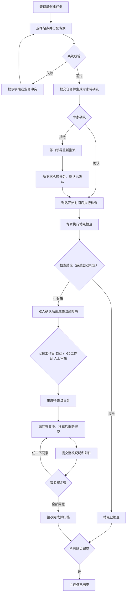
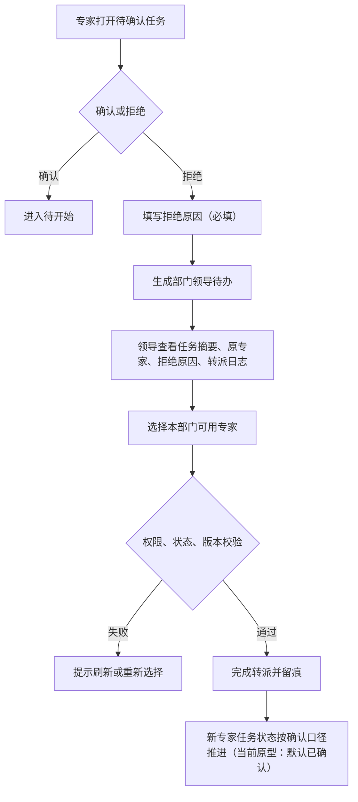

# 面积检查与整改系统 · 需求规格说明书

> 文档版本：V1.1（整合校对版）  
> 编制日期：2026-07-17  
> 文档状态：评审稿  
> 目标读者：研发团队  
> 基线范围：`docs/` + `prototypes/rectification/` 全部内容  
> 文档说明：本文档整合了仓库中全部需求文档内容，并在交叉校核后标记了所有不一致项与待确认项。**标注"【校对】"的内容为跨文档比对发现的差异或问题，实施前必须统一。**

---

## 目录

1. [文档信息](#1-文档信息)
2. [项目概述](#2-项目概述)
3. [用户角色与权限](#3-用户角色与权限)
4. [核心业务流程](#4-核心业务流程)
5. [状态机定义](#5-状态机定义)
6. [页面清单与交互说明](#6-页面清单与交互说明)
7. [功能需求](#7-功能需求)
8. [字段字典](#8-字段字典)
9. [校验与异常处理](#9-校验与异常处理)
10. [数据模型建议](#10-数据模型建议)
11. [接口需求建议](#11-接口需求建议)
12. [非功能需求建议](#12-非功能需求建议)
13. [校对结果：跨文档一致性问题](#13-校对结果跨文档一致性问题)
14. [待确认事项清单](#14-待确认事项清单)

---

## 1. 文档信息

### 1.1 基本信息

| 项目 | 内容 |
| --- | --- |
| 文档名称 | 面积检查与整改系统 · 需求规格说明书 |
| 当前版本 | V1.1（整合校对版） |
| 文档状态 | 评审稿 |
| 编制日期 | 2026-07-17 |
| 业务负责人 | 待确认 |
| 产品负责人 | 待确认 |
| 技术负责人 | 待确认 |

### 1.2 版本历史

| 版本 | 日期 | 修改人 | 修改内容 | 状态 |
| --- | --- | --- | --- | --- |
| V1.0 | 2026-07-13 | — | 首版完整需求规格 | 待评审 |
| **V1.1** | **2026-07-17** | **AI 助手** | **跨文档整合校对，修正不一致项，新增核对清单** | **待评审** |

---

## 2. 项目概述

### 2.1 项目背景

面积检查业务涉及管理人员、检查专家、部门领导、整改责任人等多个角色，覆盖任务创建、站点选择、专家确认、现场检查、整改通知书、整改执行和专家复查。当前缺乏统一系统，存在以下问题：

- 任务口径不一致、跨端状态不同步
- 整改责任不清、单据和证据分散
- 异常处理（拒绝、转派、超期）无留痕

本项目通过 **PC Web 管理后台**、**专家 APP/H5** 和 **部门领导 APP/H5** 三端，形成任务→站点→检查记录→整改通知书→整改任务→复查意见的完整关联链。

### 2.2 项目范围

| 范围类型 | 内容 |
| --- | --- |
| **本期范围** | 任务管理、专家确认与转派、站点检查与实测复核、整改通知书审核、整改执行与复查、站点查询与导出、专家 APP、部门领导 APP |
| **原型覆盖** | 25+ HTML 页面、11 份需求文档、2 套 APP 移动端演示 |
| **非本期范围** | 生产级登录/统一认证、真实消息推送、电子签章、文件病毒扫描、正式导出服务、数据库和接口生产实现 |

### 2.3 名词定义

| 名词 | 定义 |
| --- | --- |
| 主任务 | 业务管理员创建的一次面积检查任务，包含周期、站点和专家分配 |
| 专家任务 | 主任务分配到单个专家后的个人待办，含确认/拒绝/转派 |
| 站点检查 | 主任务下某个站点的实际检查执行单元，含检查记录单 |
| 检查记录单 | 专家针对站点填写的 7 项检查结果、结论、说明和签名记录 |
| 整改通知书 | 检查结论为不合格时生成、经双人确认和审核后下发的整改要求 |
| 整改告知书 | 整改责任人提交的整改情况说明及证明附件 |
| 整改任务 | 通知书审核通过后生成的整改执行对象 |
| 双人确认（会签） | 两名专家分别提交意见，满足规则后推进业务状态 |
| 转派 | 原专家拒绝后，由部门领导重新指定本部门专家 |
| 超期 | 超过整改截止时间仍未完成整改提交的派生状态 |

---

## 3. 用户角色与权限

### 3.1 角色定义

| 角色 | 使用端 | 数据范围 | 核心职责 |
| --- | --- | --- | --- |
| **业务管理员** | PC Web | 全部任务和站点（默认） | 创建/编辑任务、选择站点、分配专家、查看进度、审核整改通知书 |
| **检查专家** | PC Web + APP | 本人参与的任务及站点 | 确认/拒绝任务、现场检查、填写记录单、实测复核、双人确认、整改复查 |
| **部门领导** | APP | 本部门专家及转派任务 | 处理专家拒绝后的重新指派 |
| **整改责任人** | PC Web | 本人负责的整改任务 | 接收整改、执行整改、提交说明和附件 |
| **管理部主任** | PC Web | 本管理部数据 | 只读查看，不参与操作 |

### 3.2 权限矩阵

| 功能/对象 | 业务管理员 | 检查专家 | 部门领导 | 整改责任人 | 管理部主任 |
| --- | --- | --- | --- | --- | --- |
| 任务列表/详情 | 全量 | 本人任务 | 本部门转派相关 | 关联整改只读 | 本部门只读 |
| 创建/编辑任务 | ✅ 草稿/待开始全量；进行中仅专家 | ❌ | ❌ | ❌ | ❌ |
| 删除任务 | ✅ 仅草稿/待开始 | ❌ | ❌ | ❌ | ❌ |
| 任务确认/拒绝 | 只读 | ✅ 本人待确认 | ❌ | ❌ | 只读 |
| 转派审核 | 只读结果 | ❌ | ✅ 本部门待处理 | ❌ | 只读 |
| 检查记录填写 | 只读 | ✅ 抢占成功者可编辑 | ❌ | ❌ | 只读 |
| 检查记录确认 | 只读 | ✅ 非填写专家可操作 | ❌ | ❌ | 只读 |
| 实测复核 | 只读 | ✅ 本任务专家 | ❌ | ❌ | 只读 |
| 通知书审核 | ✅ 待审核可操作 | 只读本人相关 | ❌ | 只读要求 | 只读 |
| 接收/提交整改 | 只读 | 只读/复查 | ❌ | ✅ 本人任务 | 只读 |
| 整改复查 | 只读结果 | ✅ 两位复查专家 | ❌ | 只读结果 | 只读 |
| 站点导出 | ✅ 授权范围 | ❌ | ❌ | ❌ | 待确认 |

### 3.3 权限控制原则

1. **字段权限四级制**：隐藏 → 脱敏只读 → 只读 → 可编辑
2. **按钮权限四维控制**：角色 + 组织范围 + 对象状态 + 本人待办
3. **前端仅改善体验**，服务端必须重新鉴权
4. **越权提示**"无权执行该操作"，审计日志记录真实拒绝原因

---

## 4. 核心业务流程

### 4.1 主流程（正常链路）



### 4.2 异常流程

| 异常场景 | 处理方式 | 关键规则 |
| --- | --- | --- |
| **专家拒绝任务** | 填写必填拒绝原因 → 生成部门领导待办 → 领导选择本部门专家 → 新专家默认已确认 | 拒绝原因 200 字以内必填 |
| **检查记录单驳回** | 任一检查人点击"驳回" → 退回填写人修改 → 修改后重新提交确认 | 驳回原因必填 |
| **整改通知书审核驳回** | 审核人选择驳回 → 退回修改 → 修改后重新提交审核 | 驳回意见必填 |
| **整改复查退回** | 任一专家不同意 → 退回整改中 → 责任人补充后重新提交 | 不同意原因必填 |
| **整改超期** | 超过截止时间 → 状态变为"已超期" → 红色显示超期天数 → 仍可提交但保留记录 | 超期不阻断提交 |

**【校对】"不同意"后的行为分歧**：
- `业务流程.md` 和 `交互规则.md` 中，检查记录单确认的"不同意"**仅记录状态，不触发退回修改**，确认区保持"确认中"
- `状态流转总表.md` 中，"确认中→任一检查人驳回→待修改"
- `需求规格说明书 V1.0` 中，检查记录单确认的"不同意" 写为"驳回" 并触发退回
- **结论**：当前三个文档存在分歧，**P0 优先级，实施前必须统一**

### 4.3 专家拒绝与转派流程



---

## 5. 状态机定义

> 💡 **研发提示**：以下为系统中 7 大业务对象的状态流转定义。每个状态变化必须由服务端状态机校验，前端仅依据服务端返回的 `allowedActions` 渲染按钮。

### 5.1 主任务

```
草稿 → 待开始 → 进行中 → 已结束
  ↑       ↑
  编辑    编辑（可编辑全部）
```

| 当前状态 | 触发动作 | 下一状态 | 角色 | 说明 |
| --- | --- | --- | --- | --- |
| 草稿 | 提交任务 | 待开始 | 业务管理员 | 基础信息+站点+专家全部完成 |
| 待开始 | 到达开始时间 | 进行中 | 系统自动 | 状态自动推进 |
| 待开始 | 编辑后重新提交 | 草稿 | 业务管理员 | 编辑重新提交回到待开始 |
| 进行中 | 所有站点检查完成 | 已结束 | 系统自动 | 不等待整改完成 |
| 进行中 | 编辑专家分配 | 进行中 | 业务管理员 | 仅改专家，基础信息锁定 |

> **【校对】**：`V1.0 需求规格说明书` 中主任务"待开始→编辑→草稿" 与 `状态流转总表` 中"待开始→编辑→草稿"一致。但原型中编辑后重新提交是否回到"待开始"在页面中未体现，需确认。

### 5.2 专家任务

```
待确认 → 待开始 → 进行中 → 已结束
  ↓
已拒绝/转派中 → 进行中（转派成功后）
```

| 当前状态 | 触发动作 | 下一状态 | 角色 | 说明 |
| --- | --- | --- | --- | --- |
| 待确认 | 专家确认 | 待开始 | 检查专家 | 确认后等待开始时间 |
| 待确认 | 专家拒绝 | 已拒绝/转派中 | 检查专家 | 拒绝原因必填 |
| 已拒绝/转派中 | 部门领导指派新专家 | 进行中 | 部门领导 | 新专家默认已确认 |
| 待开始 | 到达开始时间 | 进行中 | 系统自动 | — |
| 进行中 | 所有站点完成 | 已结束 | 系统自动 | — |

### 5.3 站点检查

```
待检查 → 检查中 → 已检查（合格）
                  → 不合格 → 待整改 → 已归档
```

| 当前状态 | 触发动作 | 下一状态 | 角色 | 说明 |
| --- | --- | --- | --- | --- |
| 待检查 | 专家开始检查 | 检查中 | 检查专家 | 点击"开始检查" |
| 检查中 | 检查记录提交→合格 | 已检查 | 系统自动 | 全部检查项合格 |
| 检查中 | 检查记录提交→不合格 | 不合格 | 系统自动 | 存在不合格项 |
| 不合格 | 双人确认后生成整改通知书 | 待整改 | 系统自动 | 整改通知单生效 |
| 不合格 | 确认中驳回 | 检查中 | 检查专家 | 退回修改检查记录单 |
| 待整改 | 整改任务全部完成 | 已归档 | 系统自动 | 整改复查通过 |

> **【校对】**："不合格→确认中驳回→检查中" 这条路径在 `状态流转总表` 中有定义，但 `业务流程.md` 中检查记录单"不同意"不触发退回修改。此路径需确认是否真的存在。

### 5.4 检查记录单

```
待填写 → 填写中 → 确认中 → 已完成
                  ↓
                待修改 → 确认中（重新提交后）
```

| 当前状态 | 触发动作 | 下一状态 | 角色 | 说明 |
| --- | --- | --- | --- | --- |
| 待填写 | 检查人开始填写 | 填写中 | 检查专家 | 先点先得，另一人只读 |
| 填写中 | 填写人提交 | 确认中 | 检查专家 | 提交后内容锁定 |
| 确认中 | 全部检查人同意 | 已完成 | 检查专家 | 填写人默认已同意 |
| 确认中 | 任一检查人驳回 | 待修改 | 检查专家 | 驳回原因必填（见校对注） |
| 待修改 | 填写人修改后重新提交 | 确认中 | 检查专家 | 重新确认 |

> **【校对】P0**：`业务流程.md` 和 `交互规则.md` 中"不同意仅记录状态、不触发退回修改"，但 `状态流转总表` 中有"确认中→待修改" 的流转。**此差异必须在实施前统一**。

### 5.5 整改通知书

```
待生效 → 待审核 → 审核通过 → 已下发（自动生成整改任务）
                  → 审核驳回 → 待填写（修改后重新提交）
```

| 当前状态 | 触发动作 | 下一状态 | 角色 | 说明 |
| --- | --- | --- | --- | --- |
| 待生效 | 双人确认 | 待审核 | 系统自动 | 整改通知书需双人确认 |
| 待审核 | 审核通过（≤30工作日自动） | 审核通过 | 系统自动 | 自动审核 |
| 待审核 | 审核通过（>30工作日人工） | 审核通过 | 业务管理员 | 人工审核 |
| 待审核 | 审核驳回 | 审核驳回 | 业务管理员 | 驳回后返回修改 |
| 审核通过 | 生成整改任务 | 已下发 | 系统自动 | 通知单审核通过后自动生成 |
| 审核驳回 | 修改后重新提交 | 待审核 | 业务管理员 | — |

### 5.6 整改任务

```
待整改 → 整改中 → 待专家审核 → 已完成
          ↓（超期）            ↑
        已超期 → 待专家审核   任一不同意
                （提交后）     → 整改中
```

| 当前状态 | 触发动作 | 下一状态 | 角色 | 说明 |
| --- | --- | --- | --- | --- |
| 待整改 | 责任人接收 | 整改中 | 整改责任人 | 接收后开始计时 |
| 整改中 | 超过截止时间未提交 | 已超期 | 系统自动 | 显示超期天数，仍可提交 |
| 整改中 | 提交整改 | 待专家审核 | 整改责任人 | 说明+附件必填 |
| 已超期 | 提交整改 | 待专家审核 | 整改责任人 | 保留超期记录 |
| 待专家审核 | 双人复查→全部同意 | 已完成 | 检查专家 | 完成归档 |
| 待专家审核 | 双人复查→任一不同意 | 整改中 | 检查专家 | 退回整改，补充后重新提交 |

### 5.7 状态颜色映射（跨端统一）

> 💡 **研发提示**：以下颜色映射必须在 PC 端和 APP 端统一，由服务端或统一配置文件维护，避免多端不一致。

| 状态 | 颜色 | 十六进制 | 出现对象 |
| --- | --- | --- | --- |
| 草稿/待填写/待检查 | 灰色 | #8c8c8c | 主任务、检查记录单、站点 |
| 待确认（专家） | 黄色/橙色 | #d46b08 | 专家任务 |
| 待开始 | 紫色 | #2f54eb | 主任务、专家任务 |
| 进行中/检查中/填写中/整改中 | 蓝色 | #1890ff | 主任务、专家任务、站点、记录单、整改 |
| 已检查/已完成/已通过 | 绿色 | #52c41a | 站点、记录单、通知书 |
| 不合格/待整改 | 橙色 | #fa8c16 | 站点、整改任务 |
| 已超期 | 红色 | #ff4d4f | 整改任务 |
| 待专家审核 | 紫色 | #722ed1 | 整改任务 |
| 已结束/已归档 | 灰色 | #8c8c8c | 主任务、专家任务、站点 |

> **【校对】**：`原型一致性检查报告` 中提出移动端状态颜色体系缺失紫色（待专家审核状态），已确认整改任务颜色映射包含紫色。PC 端 task-detail 的状态 Tag 存在硬编码为蓝色的问题，须统一使用上述映射。

---

## 6. 页面清单与交互说明

### 6.1 页面总览

| 模块 | 页面 | 文件 | 终端 | 角色 |
| --- | --- | --- | --- | --- |
| 首页 | 模块首页 | `prototypes/rectification/index.html` | PC Web | 全部 |
| 任务管理 | 任务列表 | `task-list.html` | PC Web | 管理员、主任 |
| 任务管理 | 任务详情 | `task-detail.html` | PC Web | 管理员、主任、专家 |
| 任务创建 | 基础信息 | `task-create.html` | PC Web | 管理员 |
| 任务创建 | 抽选专家 | `task-expert.html` | PC Web | 管理员 |
| 专家任务 | 我的任务 | `my-task-list.html` | PC Web | 专家、部门领导 |
| 现场检查 | 开始检查 | `my-task-check.html` | PC Web | 专家 |
| 通知书 | 通知书审核 | `review-notice.html` | PC Web | 管理员 |
| 整改管理 | 整改任务列表 | `rectification-task.html` | PC Web | 责任人、管理员 |
| 整改管理 | 整改任务详情 | `rectification-detail.html` | PC Web | 全部 |
| 站点管理 | 站点明细 | `site-detail-list.html` | PC Web | 管理员、主任 |
| 站点管理 | 站点详情 | `site-detail.html` | PC Web | 全部 |
| 专家 APP | 工作台 | `expert-app.html` | APP/H5 | 专家 |
| 专家 APP | 任务列表 | `expert-app-task-list.html` | APP/H5 | 专家 |
| 专家 APP | 任务确认 | `expert-app-task-confirm.html` | APP/H5 | 专家 |
| 专家 APP | 任务详情 | `expert-app-task-detail.html` | APP/H5 | 专家 |
| 专家 APP | 站点列表 | `expert-app-site-list.html` | APP/H5 | 专家 |
| 专家 APP | 站点详情 | `expert-app-site-detail.html` | APP/H5 | 专家 |
| 专家 APP | 楼栋详情 | `expert-app-building-detail.html` | APP/H5 | 专家 |
| 专家 APP | 检查记录单 | `expert-app-check-record.html` | APP/H5 | 专家 |
| 专家 APP | 电子签名 | `expert-app-signature.html` | APP/H5 | 专家 |
| 领导 APP | 转派审核 | `dept-leader-app-standalone.html` | APP/H5 | 部门领导 |

### 6.2 关键交互规则

#### 6.2.1 通用规则

| 组件 | 规则 |
| --- | --- |
| 必填字段 | 标红星；提交时字段红框并自动滚动至首个错误 |
| 日期区间 | 开始、结束均必填；结束不得早于开始 |
| 状态 Tag | 同一状态在 PC 和 APP 使用统一文案和颜色映射（见 5.7 节） |
| 长文本 | 显示字数上限；拒绝、驳回、退回原因按规则必填 |
| 表格 | 字段尽量不换行；长文本省略 + Tooltip；操作列 sticky 固定 |
| 按钮 | 提交后 loading 并禁用；状态不允许时禁用并解释原因 |
| 空态 | 区分无数据、无匹配结果、无权限、加载失败四种 |
| 返回 | 详情返回列表时恢复筛选、分页和滚动位置 |
| 未保存离开 | 提示"保存草稿/放弃/继续编辑"（默认假设/待确认） |

#### 6.2.2 任务创建与编辑规则

| 场景 | 可编辑字段 | 按钮 | 备注 |
| --- | --- | --- | --- |
| 新建 | 全部 | 暂存、下一步 | 至少选 1 个站点 |
| 编辑-草稿/待开始 | 全部 | 暂存、下一步、提交 | 全量编辑 |
| 编辑-进行中 | 仅专家分配 | 上一步、暂存、提交 | 基础信息+站点锁定 |
| 编辑-已结束 | 无 | 仅查看 | 编辑按钮置灰 |

#### 6.2.3 检查记录单交互规则

| 状态 | 填写人操作 | 非填写人操作 |
| --- | --- | --- |
| 待填写 | 点击"开始填写" | 同（先点先得） |
| 填写中 | 编辑、暂存、提交 | 只读查看 |
| 确认中 | 已自动同意（只读） | 同意/不同意按钮显示 |
| 已完成 | 只读查看 | 只读查看 |

> **【校对】P0**：`交互规则.md` 中确认区的按钮是"同意/不同意"且不触发退回；`状态流转总表` 中有"驳回"和"待修改"状态。此处必须统一。

#### 6.2.4 实测复核规则

| 规则项 | 说明 |
| --- | --- |
| 触发条件 | 普查依据为"实测"的建筑 |
| 操作入口 | 唯一入口为"实测复核"Tab 内表格 |
| 输入方式 | `type="text" inputmode="decimal"`，无步进箭头 |
| 保存方式 | 失焦自动保存单条，**无保存按钮** |
| 照片要求 | 至少 1 张（保存时校验） |
| 面积要求 | >0（保存时校验） |
| 误差超限 | 不阻断保存，Toast 提示"请重点核查" |

#### 6.2.5 误差三档规则

| 普查面积范围 | 允许误差 | 计算公式 |
| --- | --- | --- |
| ≤500㎡ | 相对误差 ≤ ±3% | \|复核面积 - 普查面积\| / 普查面积 × 100% > 3% |
| 500 < 面积 ≤ 2000㎡ | 相对误差 ≤ ±2% | \|复核面积 - 普查面积\| / 普查面积 × 100% > 2% |
| >2000㎡ | 绝对误差 ≤ ±60㎡ | \|复核面积 - 普查面积\| > 60 |

---

## 7. 功能需求

### 7.1 任务管理

#### FR-TASK-01 查询和查看任务

- **描述**：按计划名称、年度和状态查询任务，查看任务状态、专家确认、站点进度、合格/不合格数量
- **前置**：已登录并有权限
- **正常流程**：进入列表 → 输入筛选 → 查询 → 查看匹配任务 → 详情 → 查看进度和统计
- **验收标准**：系统仅返回授权数据，详情状态、进度和站点统计保持一致

#### FR-TASK-02 创建并暂存任务

- **描述**：填写任务名称、开始/结束时间、选择至少一个站点，可暂存草稿
- **前置**：站点主数据可用
- **正常流程**：新建 → 填基础信息 → 选站点 → 暂存
- **验收标准**：保存唯一草稿和当前站点选择，返回草稿标识

#### FR-TASK-03 抽选和分配专家

- **描述**：配置抽取规则（年龄优先、检查间隔、管理部人数），按管理部分配专家
- **前置**：任务已选站点
- **正常流程**：配置规则 → 抽取候选 → 按管理部选择 → 填满槽位
- **验收标准**：不重复、符合组织范围的专家分配，全部槽位占满后才可提交

#### FR-TASK-04 提交、编辑和删除任务

- **描述**：提交完整任务；草稿/待开始可全量编辑和删除，进行中仅调专家，已结束只读
- **正常流程**：提交→待开始；编辑回填最新数据；删除二次确认+软删除
- **验收标准**：进行中任务编辑时基础信息和站点只读，后端拒绝其他字段变更

### 7.2 专家确认与转派

#### FR-ASSIGN-01 专家确认或拒绝

- **描述**：专家查看任务范围后确认接受，或填写原因拒绝
- **前置**：任务为本人待确认
- **验收标准**：拒绝后生成部门领导待办，保存原因和时间

#### FR-ASSIGN-02 部门领导转派

- **描述**：从本部门可用专家中重新指派
- **前置**：任务属于本部门且待转派
- **验收标准**：关闭原待办，保存完整转派记录，跨端同步

> **待确认**：新专家是否默认已确认无需再次确认？当前原型如此处理。

### 7.3 现场检查与实测复核

#### FR-CHECK-01 开始站点检查

- **描述**：专家选择本人站点开始或继续检查
- **验收标准**：系统将站点推进到检查中并开放录入入口

#### FR-CHECK-02 填写检查记录单

- **描述**：7 项检查结果（是/否/不适用），系统自动判定合格/不合格
- **前置**：获得填写锁
- **验收标准**：保存不可覆盖的当前版本，按结论推进站点状态

#### FR-CHECK-03 双人确认检查结果

- **描述**：填写人提交后自动同意，另一专家独立确认
- **验收标准**：两份独立意见，双方确认后完成
- **【校对】P0**：不同意的后续行为（保持确认中 vs 退回待修改）存在文档冲突

#### FR-CHECK-04 实测复核

- **描述**：对普查依据为"实测"的建筑上传照片并填写复核面积
- **验收标准**：保存照片、面积、误差、专家和时间，跨端显示一致

### 7.4 整改通知书及审核

#### FR-NOTICE-01 生成和确认整改通知书

- **描述**：不合格后填写整改事项、意见、期限，双人确认后进入审核
- **验收标准**：两份独立确认记录，通知书推进到待审核

#### FR-NOTICE-02 自动或人工审核

- **描述**：≤30工作日自动通过，>30工作日人工审核
- **验收标准**：审核后只生成一个关联整改任务
- **待确认**：30工作日规则和工作日定义为默认假设

### 7.5 整改执行

#### FR-RECT-01 生成和接收整改任务

- **描述**：通知书审核通过后生成整改任务，责任人接收开始计时
- **验收标准**：只执行一次接收，推进为整改中并记录计时起点

#### FR-RECT-02 提交整改结果

- **描述**：填写整改说明（500字）+ 上传整改告知书（必填），提交后进入待专家审核
- **验收标准**：保存新版本和附件，推进到待专家审核

#### FR-RECT-03 超期处理

- **描述**：超过截止时间自动标为"已超期"，仍允许提交但保留超期记录
- **验收标准**：推进到待专家审核时保留超期状态、天数和计算依据

### 7.6 专家复查与归档

#### FR-REVIEW-01 双专家复查

- **描述**：两名专家独立查看整改材料并提交意见
- **验收标准**：两份独立意见，均同意后整改任务和站点完成归档

#### FR-REVIEW-02 复查退回和重新提交

- **描述**：任一专家不同意，退回整改中，责任人补充后重新提交
- **验收标准**：保留旧版本与复查意见，生成新版本

### 7.7 站点明细与导出

#### FR-SITE-01 查询站点全链路

- **描述**：按组织树和多维条件查询站点，查看普查、检查、通知书、整改信息
- **验收标准**：展示关联的当前有效检查和整改数据

#### FR-SITE-02 导出台账

- **描述**：导出授权范围内全部站点台账；自管站支持单站变化明细导出
- **验收标准**：文件只包含授权且匹配筛选的数据，记录操作日志

### 7.8 专家 APP

#### FR-APP-01 移动任务与站点处理

- **描述**：移动端查看待办、确认/拒绝、填写检查、签名、复核
- **验收标准**：APP 操作后 PC 状态与服务端一致

### 7.9 部门领导 APP

#### FR-LEADER-01 移动转派审核

- **描述**：移动端查看转派待办、拒绝原因、处理日志，重新指派专家
- **验收标准**：记录完整转派链路，跨端展示一致

---

## 8. 字段字典

### 8.1 7 项检查清单

> 以下为固定检查项，提交时系统自动判定：任一"否"→不合格；全部"是/不适用"→合格

| 序号 | 检查项 | 可选值 | 子项（选"否"时展开） | 含"不适用" |
| --- | --- | --- | --- | --- |
| 1 | 面积核查汇总表是否完整、数据填写正确、项目填写齐全？ | 是/否 | 数据是否正确、项目填写不齐全、表格不完整 | ❌ |
| 2 | 用热范围平面图是否具备绘制人、审批流程完整、绘制日期，且方位正确？ | 是/否 | 无绘制人签字、无绘制日期、方位标注不正确、现场建筑名称与图纸不一致、楼号/层数不一致、未入网建筑与平面图不符 | ❌ |
| 3 | 面积核查依据（确权书及相关证明材料）是否有效且齐全？ | 是/否 | 确权书缺失或无效等 11 项 | ❌ |
| 4 | 是否存在面积变化情况？ | 是（存在变化）/否（无变化） | 无子项 | ❌ |
| 5 | 面积核查汇总表与用热现场是否一致（建筑名称、楼号、层数、未入网建筑等）？ | 是/否 | 建筑名称不一致等 6 项 | ❌ |
| 6 | 商业门头平面图与现场顺序是否一致？ | 是/否 | 平面图顺序与现场不一致、商业门头位置错误、标识不清或缺失 | ✅ |
| 7 | 实测计算是否满足制度要求？ | 是/否 | 偏差值大于 3%/2%/±60m² | ✅ |

### 8.2 核心字段列表

> 💡 **研发提示**：以下为各页面核心字段。完整版请参考 `docs/字段字典.md`。

| 页面 | 核心字段 |
| --- | --- |
| task-list | taskName, startDate, endDate, year, status, expertConfirm (N/M), progress (N/M), qualified, unqualified, createdAt, completedAt |
| task-create | taskName, startDate, endDate, siteCode[], siteName[], dept, area, siteType, address |
| task-expert | ruleAge, ruleInterval, deptName, siteCount, assignedCount, slotType (一类/二类), slotExpert |
| my-task-list | taskName, year, status (待确认/待开始/进行中/已结束), pendingCount |
| my-task-check | 7 项检查项 radio, subCheckbox, conclusion (合格/不合格), problemDesc, siteNote, signature |
| review-notice | noticeNo, dept, content, opinion, deadlineDays, auditResult, auditOpinion |
| rectification-task | taskName, siteName, status, owner, deadline, overdueDays, currentNode |
| site-detail-list | siteCode, siteName, dept, area, siteType, address, checkStatus, result, rectificationStatus |

---

## 9. 校验与异常处理

| 异常分类 | 触发条件 | 前端表现 | 后端处理 |
| --- | --- | --- | --- |
| 字段校验失败 | 必填为空、格式错误、结束早于开始 | 字段红框、错误文案、首错误自动定位 | 必须重复校验 |
| 权限不足 | 角色/组织/状态/待办不满足 | 隐藏/禁用入口；直达时无权限页 | 后端强鉴权，拒绝原因记录审计 |
| 保存失败 | 网络中断、服务错误、附件失败 | 保留输入、错误条、显示错误编号 | 事务回滚，记录错误链路 |
| 提交失败 | 业务校验或依赖失败 | 不离开页面，定位业务冲突 | 事务、幂等键、状态机校验 |
| 数据为空 | 查询无结果 | 空态，区分无数据与无匹配 | 查询权限校验 |
| 对象不存在 | URL 无效、对象已删除 | 404/失效卡片 | 防越权泄露 |
| 业务规则冲突 | 状态变化、专家不可用、版本冲突 | Modal + 说明 | 状态机+版本号+唯一约束 |
| 重复提交 | 连点、弱网重试 | 首次点击后 loading/禁用 | 幂等键，重复请求返回首次结果 |
| 并发冲突 | 多人同时编辑/审核 | 冲突 Modal | 乐观锁 version；检查单抢占锁 |
| 文件异常 | 格式/大小不符、上传中断 | 单文件错误，可删除重传 | MIME/后缀双检 |
| 跨端同步延迟 | APP 操作后 PC 未及时刷新 | 状态更新时间，手动刷新/轮询 | 服务端单一事实源 |

---

## 10. 数据模型建议

> ⚠️ **方案建议，待研发确认**

### 10.1 核心 ER

```
INSPECTION_TASK 1──N TASK_SITE N──1 SITE
INSPECTION_TASK 1──N EXPERT_TASK N──1 USER
EXPERT_TASK 1──N TRANSFER_RECORD
TASK_SITE 1──1 SITE_INSPECTION
SITE_INSPECTION 1──N CHECK_RECORD_VERSION N──N CHECK_CONFIRMATION
SITE_INSPECTION 1──N MEASURE_REVIEW
SITE_INSPECTION 1──1 RECTIFICATION_NOTICE
RECTIFICATION_NOTICE 1──N NOTICE_CONFIRMATION
RECTIFICATION_NOTICE 1──1 RECTIFICATION_TASK
RECTIFICATION_TASK 1──N RECTIFICATION_VERSION N──N RECTIFICATION_REVIEW
```

### 10.2 核心实体

| 实体 | 关键字段 | 备注 |
| --- | --- | --- |
| inspection_task | id, task_no(唯一), name, year, start_at, end_at, status, version | 主任务 |
| task_site | id, task_id, site_id, status, result, completed_at | 任务-站点关联 |
| expert_assignment | id, task_id, org_id, expert_id, expert_type, active | 分配历史（不覆盖旧记录） |
| expert_task | id, task_id, expert_id, status, confirmed_at, rejected_reason | 专家个人任务 |
| transfer_record | id, expert_task_id, from_expert, to_expert, reason, operator | 转派完整链路 |
| site | id, site_code, site_name, org_id, site_type, address, contract_area, measured_area | 站点主数据 |
| site_inspection | id, task_site_id, status, result, lock_user_id, lock_expire_at, version | 站点检查+填写锁 |
| check_record_version | id, inspection_id, version_no, items_json, result, description, signature_id | 记录版本 |
| check_confirmation | id, record_version_id, expert_id, decision, opinion | 双人确认 |
| measure_review | id, inspection_id, building_id, survey_area, review_area, deviation | 实测复核 |
| rectification_notice | id, notice_no(唯一), inspection_id, content, deadline, status, version | 整改通知书 |
| rectification_task | id, notice_id, owner_id, status, accepted_at, deadline, overdue_days, version | 整改任务 |
| rectification_version | id, task_id, version_no, description, submitted_by | 整改提交版本 |
| rectification_review | id, task_id, version_no, expert_id, decision, opinion | 复查意见 |
| attachment | id, biz_type, biz_id, file_name, mime_type, size, hash, storage_key, scan_status | 通用附件 |
| audit_log | id, biz_type, biz_id, action, from_status, to_status, operator_id, request_id | 审计日志 |

### 10.3 数据规则

1. 所有业务表使用不可变主键；展示编号另设唯一字段
2. 主任务、检查、通知书、整改任务使用 `version` 乐观锁
3. 单据修改新增版本，不覆盖已提交版本
4. 附件通过业务类型和业务 ID 关联，逻辑删除
5. 状态变更必须同时写业务对象和审计日志（同事务）
6. 关键时间使用服务端统一时区保存

---

## 11. 接口需求建议

> ⚠️ **方案建议，待研发确认**

### 11.1 通用约定

| 项目 | 约定建议 |
| --- | --- |
| 协议 | HTTPS + JSON |
| 身份 | 统一身份令牌 |
| 幂等 | 写接口携带 `Idempotency-Key` |
| 并发 | 更新携带 `version` |
| 追踪 | `requestId` |
| 分页 | `pageNo`、`pageSize`、`total` |
| 时间 | ISO 8601，服务端统一时区 |
| 错误 | 统一 `code`、`message`、`fieldErrors`、`requestId` |

### 11.2 关键接口清单

| 编号 | 路径 | 用途 |
| --- | --- | --- |
| API-01 | `GET /inspection-tasks` | 查询主任务列表 |
| API-02 | `POST /inspection-tasks` | 创建/暂存任务 |
| API-03 | `GET /inspection-tasks/{id}` | 任务详情（含 allowedActions） |
| API-04 | `PUT /inspection-tasks/{id}` | 编辑任务 |
| API-05 | `DELETE /inspection-tasks/{id}` | 删除/作废任务 |
| API-08 | `POST /inspection-tasks/{id}:submit` | 提交任务 |
| API-10 | `POST /expert-tasks/{id}:confirm` | 专家确认 |
| API-11 | `POST /expert-tasks/{id}:reject` | 专家拒绝 |
| API-13 | `POST /transfer-tasks/{id}:assign` | 部门领导转派 |
| API-16 | `POST /check-records:save-draft` | 暂存检查记录 |
| API-17 | `POST /check-records:submit` | 提交检查记录 |
| API-18 | `POST /check-records/{id}/confirmations` | 确认检查记录 |
| API-19 | `POST /measure-reviews` | 保存实测复核 |
| API-21 | `POST /rectification-notices/{id}/confirmations` | 通知书专家确认 |
| API-22 | `POST /rectification-notices/{id}:audit` | 人工审核通知书 |
| API-24 | `POST /rectification-tasks/{id}:accept` | 接收整改 |
| API-25 | `POST /rectification-tasks/{id}/versions` | 提交整改版本 |
| API-26 | `POST /rectification-tasks/{id}/reviews` | 专家复查 |
| API-29 | `POST /exports` | 创建导出任务 |

### 11.3 前端约定建议

- 详情响应同时返回 `status`、`statusText`、`allowedActions`、`editableFields`、`version`
- 所有写接口要求 `idempotencyKey` 和对象 `version`
- 冲突统一返回可识别错误码
- 列表条件、排序、分页和权限在服务端执行
- 状态变化在同事务内写业务表和事件表

---

## 12. 非功能需求建议

> ⚠️ **方案建议，待研发确认**

| 指标 | 建议值 |
| --- | --- |
| 列表首屏 | P95 ≤ 2 秒，每页 20 条 |
| 详情加载 | P95 ≤ 2 秒，附件延迟加载 |
| 保存/提交 | P95 ≤ 3 秒（不含大文件上传） |
| 并发基线 | 300 在线用户、50 TPS 峰值 |
| 可用性 | 月度 99.9% |
| 附件单文件 | ≤ 20 MB |
| 图片单张 | ≤ 10 MB |
| 审计日志保留 | 在线 2 年、归档 5 年 |

**安全要求**：
1. TLS；令牌过期立即失效
2. 按角色、组织、对象和动作实施最小权限
3. 敏感联系方式按角色脱敏
4. 附件执行后缀、MIME、大小和病毒扫描
5. 所有写操作记录审计日志

**兼容性**：
- Web：Chrome、Edge 最近两个主版本
- 移动端：主流 Android/iOS（最低版本待确认）
- 无障碍：状态不能只依赖颜色

---

## 13. 校对结果：跨文档一致性问题

> ⚠️ **研发团队重点关注**：以下为本次整合过程中发现的跨文档差异，**实施前必须统一**。

### 🔴 P0（必须确认，影响状态机/业务流程）

| 编号 | 问题 | 冲突文档 | 描述 | 建议处理 |
| --- | --- | --- | --- | --- |
| C01 | 检查记录单"不同意"后续行为 | `状态流转总表` vs `业务流程.md` | 总表：确认中→待修改；业务流：保持确认中、不退回 | 两者选一，影响状态机 |
| C02 | 整改通知书"不同意"后续行为 | `状态流转总表` vs `交互规则.md` | 同上，通知书也有相同分歧 | 同上 |
| C03 | 整改任务生成时机 | `brief.md` vs `业务流程.md` | brief：通知书创建时立即生成；流程：双人确认+审核后生成 | 当前原型已改为审核后生成，需确认 |
| C04 | 主任务完成口径 | `brief.md` vs `业务流程.md` | brief：等待整改归档；流程：仅按检查完成统计 | 当前原型已改为仅按检查统计，需确认 |

### 🟡 P1（重要，影响交互/状态展示）

| 编号 | 问题 | 冲突文档 | 描述 |
| --- | --- | --- | --- |
| C05 | 状态颜色映射 | `原型一致性检查报告` 指出 task-detail 硬编码蓝色 | PC 端状态 Tag 颜色未使用统一映射 |
| C06 | 移动端状态颜色 | `原型一致性检查报告` 指出缺失紫色 | "待专家审核" 使用紫色需在 APP 端同步 |
| C07 | 数据源分裂 | `原型一致性检查报告` | task-list (Store) 与 task-detail (MockData) 数据源不一致 |
| C08 | 整改期限单位 | `brief.md` 用"天"，`业务流程.md` 用"工作日" | 需确认口径 |

### 🟢 P2（较低，确认即可）

| 编号 | 问题 | 描述 |
| --- | --- | --- |
| C09 | 组织树节点数量统计 | 当前按全量 mock 静态统计，是否改为随筛选动态变化 |
| C10 | 导出字段模板 | 字段、模板、水印、有效期待确认 |
| C11 | 新专家确认规则 | 转派后新专家默认已确认（待正式确认） |

---

## 14. 待确认事项清单

> 以下为需求中已识别但尚未获得业务确认的事项，按优先级排列。

### 🔴 P0 — 实施前必须确认

| 编号 | 事项 | 当前默认假设 | 影响范围 |
| --- | --- | --- | --- |
| Q01 | 检查记录单/通知书"不同意"后保持确认中还是退回待修改？ | 文档冲突，待统一 | 状态机、按钮、消息 |
| Q02 | 整改计时起点是"接收"还是"通知书审核通过"？ | 默认点击"接收"后开始 | 整改状态和时限计算 |
| Q03 | 工作日定义、30 工作日自动审核规则？ | 默认 ≤30 自动、>30 人工 | 审核和超期结果 |
| Q04 | 第二专家来源及转派后会签人员是否变化？ | 默认沿用原任务另一名专家 | 权限与会签合法性 |
| Q05 | 进行中改派专家对已检查/未检查站点的影响？ | 未定义 | 数据归属和待办冲突 |

### 🟡 P1 — 详细设计前确认

| 编号 | 事项 | 当前默认假设 |
| --- | --- | --- |
| Q06 | 任务、通知书编号生成规则 | 后端按业务类型+日期+流水号 |
| Q07 | 记录单抢占锁超时/释放/接管规则 | 服务端原子锁 |
| Q08 | APP 与 PC 的消息/刷新/离线范围 | 未定义 |
| Q09 | 附件必传范围、格式、大小及签名法律效力 | 未确认 |
| Q10 | 检查项清单是否固定还是按站点类型配置 | 当前固定 7 项 |

### 🟢 P2 — 上线前确认

| 编号 | 事项 | 当前默认假设 |
| --- | --- | --- |
| Q11 | 导出字段、模板、水印和权限范围 | 未确认 |
| Q12 | 组织树节点数量是否随筛选动态变化 | 当前静态 |
| Q13 | 草稿删除前是否二次确认 | 待实现 |
| Q14 | 待开始任务撤回 | 当前未定义 |
| Q15 | 进行中任务取消 | 当前未定义 |

---

> **文档结束**
>
> 本文档整合自以下源文件：
> - `docs/需求规格说明书.md`（V1.0）
> - `docs/brief.md`（功能规格+系统建设方案）
> - `docs/页面清单.md`、`docs/字段字典.md`、`docs/业务流程.md`
> - `docs/交互规则.md`、`docs/状态流转总表.md`、`docs/角色权限矩阵.md`
> - `docs/功能清单.md`、`docs/评审问题清单.md`、`docs/评审说明.md`
> - `prototypes/rectification/` 全部页面和 JS 代码
> - `原型一致性检查报告.md`
> - `AGENTS.md`（项目规则）
