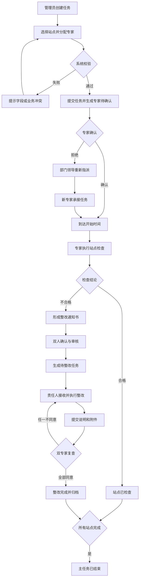
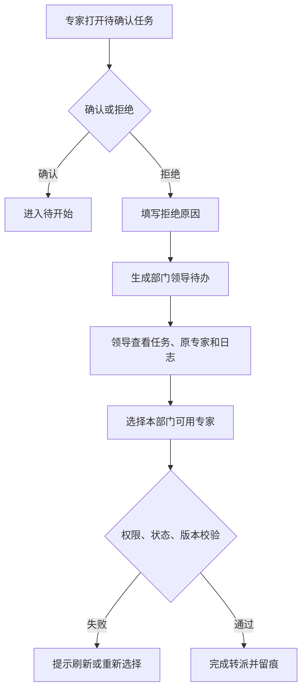
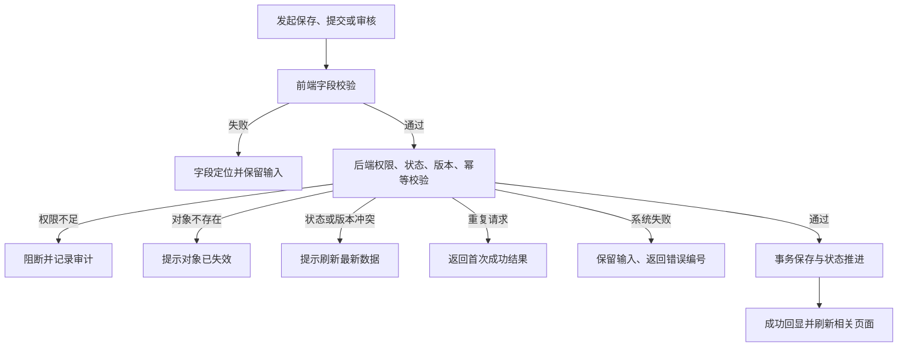
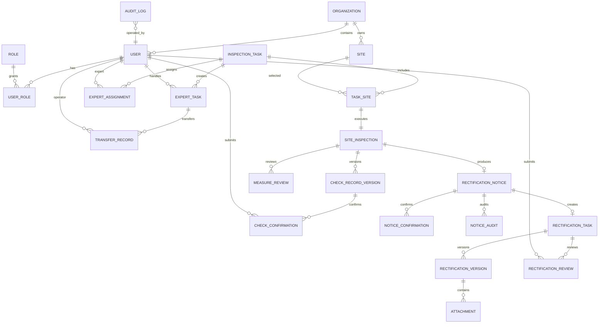

# 面积检查与整改系统需求规格说明书

> 文档路径：`/Users/sears/Desktop/VibeWork/pm-prototype-center/docs/需求规格说明书.md`  
> 页面目录：`/Users/sears/Desktop/VibeWork/pm-prototype-center/prototypes/rectification`  
> 文档状态：评审稿  
> 业务基线：当前仓库 `docs/` 与 `prototypes/rectification/`  
> 说明：本文中的建议数据模型、接口、性能指标和未获得业务确认的规则，统一标注为“方案建议，待研发确认”或“默认假设/待确认”。

---

## 1. 文档信息

### 1.1 基本信息

| 项目 | 内容 |
| --- | --- |
| 文档名称 | 面积检查与整改系统需求规格说明书 |
| 当前版本 | V1.0 |
| 文档状态 | 评审稿 |
| 编制日期 | 2026-07-13 |
| 编制人 | 待确认 |
| 业务负责人 | 待确认 |
| 产品负责人 | 待确认 |
| 技术负责人 | 待确认 |
| 测试负责人 | 待确认 |

### 1.2 版本历史

| 版本 | 日期 | 修改人 | 修改内容 | 状态 |
| --- | --- | --- | --- | --- |
| V1.0 | 2026-07-13 | 待确认 | 根据当前面积检查原型和业务文档形成首版完整需求规格 | 待评审 |

### 1.3 参与人

| 角色 | 姓名/部门 | 主要职责 |
| --- | --- | --- |
| 业务负责人 | 待确认 | 确认业务目标、范围、时限和状态规则 |
| 产品负责人 | 待确认 | 维护需求、交互、验收标准和待确认项 |
| 技术负责人 | 待确认 | 评估架构、数据、接口、性能与实施风险 |
| 测试负责人 | 待确认 | 基于正常、异常、权限和并发场景设计测试 |
| 安全/运维 | 待确认 | 评估数据安全、审计、部署、监控与可用性 |

### 1.4 评审记录

| 评审轮次 | 日期 | 参与人 | 结论 | 遗留问题 | 跟进人 |
| --- | --- | --- | --- | --- | --- |
| 第一轮 | 待评审 | 待确认 | □通过 □有条件通过 □不通过 | 待填写 | 待确认 |

---

## 2. 项目背景与目标

### 2.1 项目背景

面积检查业务涉及管理人员、检查专家、部门领导、整改责任人等多个角色，覆盖任务创建、站点选择、专家确认、现场检查、整改通知书、整改执行和专家复查。若缺少统一系统，容易出现任务口径不一致、跨端状态不同步、整改责任不清、单据和证据分散、异常处理无留痕等问题。

本项目通过 Web 管理后台、专家 APP/H5 和部门领导 APP/H5，形成任务、站点、检查记录、整改通知书、整改任务、整改材料和复查意见的完整关联链。

### 2.2 项目目标

#### 业务目标

1. 建立“任务创建—专家执行—不合格整改—专家复查—归档”的完整闭环。
2. 统一任务、站点、检查单据和整改单据的状态口径。
3. 支持专家拒绝转派、审核驳回、整改超期、复查退回等异常流程。
4. 对关键操作、状态变化、意见、附件和导出形成可追溯记录。

#### 用户目标

- 业务管理员能够高效创建任务、分配专家、掌握进度并处理审核。
- 检查专家能够在 Web 或移动端查看资料、完成检查、确认和复查。
- 部门领导能够及时处理专家拒绝后的重新指派。
- 整改责任人能够明确整改要求、期限、材料和复查结果。
- 管理部主任能够只读查看本部门检查和整改情况。

#### 平台与风控目标

- PC、专家 APP、部门领导 APP 共享服务端单一事实源。
- 权限由角色、组织范围、对象状态和本人待办共同决定。
- 所有写操作执行后端鉴权、状态机校验、版本校验和幂等控制。
- 关键业务数据不物理删除，保留版本、作废状态和审计记录。

### 2.3 项目范围

| 范围类型 | 内容 |
| --- | --- |
| 本期范围 | 任务管理、专家确认与转派、站点检查、实测复核、整改通知书审核、整改执行、专家复查、站点查询与导出、专家 APP、部门领导 APP |
| 原型范围 | 25 个 HTML 页面及相关弹窗、Tab、状态和跳转关系 |
| 非本期范围 | 生产级登录、统一身份认证、真实消息推送、真实电子签章、文件病毒扫描、正式导出服务、数据库和接口生产实现 |

### 2.4 名词定义

| 名词 | 定义 |
| --- | --- |
| 主任务 | 由业务管理员创建的一次面积检查任务，包含周期、站点和专家分配 |
| 专家任务 | 主任务分配到单个专家后的个人待办和确认状态 |
| 站点检查 | 主任务下某个站点的实际检查执行单元 |
| 检查记录单 | 专家针对站点填写的检查项、结论、说明和签名记录 |
| 整改通知书 | 检查结论不合格时形成、经确认和审核后下发的整改要求 |
| 整改告知书 | 整改责任人提交的整改情况及证明附件 |
| 整改任务 | 通知书审核通过后生成的整改执行对象 |
| 双人确认/会签 | 两名专家分别提交意见，满足规则后推进业务状态 |
| 转派 | 原专家拒绝后，由部门领导重新指定本部门专家 |
| 超期 | 超过整改截止时间仍未完成整改提交的派生状态 |

---

## 3. 用户角色

### 3.1 角色定义

| 角色 | 主要使用者 | 数据范围 | 核心职责 |
| --- | --- | --- | --- |
| 业务管理员 | 面积检查业务管理人员 | 默认全部任务和站点 | 创建任务、分配专家、查看进度、审核整改通知书 |
| 检查专家 | 被抽取或转派的专家 | 本人参与任务及其站点 | 确认任务、现场检查、单据确认、实测复核、整改复查 |
| 部门领导 | 专家所属部门领导 | 本部门专家和转派任务 | 处理专家拒绝并重新指派 |
| 整改责任人 | 片区所所长或指定人员 | 本人负责的整改任务 | 接收、执行和提交整改 |
| 管理部主任 | 管理部管理人员 | 本管理部数据 | 只读查看检查、整改、超期和统计 |
| 系统服务 | 定时任务、规则引擎 | 授权业务范围 | 时间状态推进、超期计算、任务生成、通知和留痕 |

### 3.2 权限矩阵

| 功能/对象 | 业务管理员 | 检查专家 | 部门领导 | 整改责任人 | 管理部主任 | 关键差异 |
| --- | --- | --- | --- | --- | --- | --- |
| 任务列表/详情 | 全量查看 | 本人任务 | 本部门转派相关只读 | 关联整改只读 | 本部门只读 | 无权用户不返回对象敏感字段 |
| 创建任务 | 可创建、暂存、提交 | 无 | 无 | 无 | 无 | 后端校验站点和组织范围 |
| 编辑草稿/待开始 | 基础信息、站点、专家可编辑 | 无 | 无 | 无 | 无 | 状态变化或版本冲突时阻断 |
| 编辑进行中任务 | 仅专家分配 | 无 | 无 | 无 | 无 | 基础信息和站点前后端均锁定 |
| 删除任务 | 草稿/待开始可删除 | 无 | 无 | 无 | 无 | 二次确认、后端状态校验、软删除 |
| 任务确认/拒绝 | 只读 | 本人待确认任务可操作 | 无 | 无 | 只读 | 拒绝原因必填 |
| 转派审核 | 只读结果 | 无 | 本部门待处理可操作 | 无 | 只读 | 只能选择本部门可用专家 |
| 检查记录填写 | 只读 | 抢占成功的专家可编辑 | 无 | 无 | 只读 | 另一专家只读 |
| 检查记录确认 | 只读 | 非填写专家可确认 | 无 | 无 | 只读 | 填写人提交后默认同意 |
| 实测复核 | 只读 | 本任务专家可操作 | 无 | 无 | 只读 | 仅普查依据为实测的建筑 |
| 通知书审核 | 待审核可通过/驳回 | 关联单据只读 | 无 | 只读整改要求 | 只读 | 自动/人工审核边界待确认 |
| 接收/提交整改 | 只读 | 只读/复查 | 无 | 本人任务可操作 | 只读 | 超期仍可提交并保留超期记录 |
| 整改复查 | 只读结果 | 两位复查专家独立操作 | 无 | 只读结果 | 只读 | 任一不同意退回整改 |
| 站点导出 | 授权范围可导出 | 默认不导出 | 无 | 无 | 本部门导出待确认 | 导出条件和操作人必须留痕 |

### 3.3 权限控制原则

1. 字段权限分为隐藏、脱敏只读、只读和可编辑。
2. 按钮由角色、组织范围、对象状态、本人待办和后端 `allowedActions` 共同决定。
3. 前端隐藏或禁用只用于改善体验，服务端必须重新鉴权。
4. 越权访问提示“无权执行该操作”，审计日志记录真实拒绝原因。

---

## 4. 业务流程图

### 4.1 核心业务流程描述

1. 业务管理员创建任务，填写基础信息、选择站点并分配专家。
2. 专家确认任务；拒绝时进入部门领导转派流程。
3. 到达开始时间后，专家选择站点并执行检查、实测复核和检查记录录入。
4. 合格站点完成检查；不合格站点生成整改通知书。
5. 通知书经双人确认和自动/人工审核后生成整改任务。
6. 整改责任人接收、执行并提交整改说明和附件。
7. 两名专家独立复查；均同意后完成归档，任一不同意则退回整改。
8. 所有站点完成后，主任务结束。

### 4.2 专家拒绝与转派流程

### 4.3 异常兜底流程

---

## 5. 功能需求（核心）

### 5.1 任务创建与管理

#### FR-TASK-01 查询和查看任务

- **需求描述**：业务管理员按计划名称、年度和状态查询任务，查看任务状态、专家确认、站点进度、合格/不合格数量和详情。
- **前置条件**：用户已登录并具备任务查看权限。
- **正常流程**：进入任务列表 → 输入筛选条件 → 查询 → 查看匹配任务 → 点击详情 → 查看进度、基础信息和站点统计。
- **异常流程**：无匹配数据展示筛选空态；对象已删除或无权限时停止加载详情；查询失败保留条件并允许重试。
- **验收标准**：
  - **Scenario:** 查询并查看授权范围内任务
  - **Given:** 用户拥有任务查看权限且存在匹配任务
  - **When:** 用户组合筛选并打开一条任务详情
  - **Then:** 系统仅返回授权数据，详情状态、进度和站点统计保持一致。

#### FR-TASK-02 创建并暂存任务

- **需求描述**：业务管理员填写任务名称、开始/结束时间并选择至少一个站点，可暂存草稿。
- **前置条件**：用户具备创建权限；站点主数据可用。
- **正常流程**：点击新建 → 填写基础信息 → 打开站点选择器 → 查询并选择站点 → 确认 → 暂存。
- **异常流程**：必填为空、结束早于开始、未选择站点时字段报错；站点已失效或版本冲突时提示刷新。
- **验收标准**：
  - **Scenario:** 暂存一个未完成任务
  - **Given:** 管理员已填写最小可保存信息
  - **When:** 管理员点击暂存
  - **Then:** 系统保存唯一草稿和当前站点选择，并返回草稿标识和成功提示。

#### FR-TASK-03 抽选和分配专家

- **需求描述**：管理员配置年龄优先、检查间隔、管理部人数、专家库范围和抽取数量，为任务涉及的管理部分配专家。
- **前置条件**：任务已选择站点；专家主数据和组织关系可用。
- **正常流程**：进入步骤 2 → 配置规则 → 抽取候选专家 → 按管理部选择专家 → 填满必需槽位。
- **异常流程**：专家停用、重复分配、跨组织、槽位未满或并发被占用时阻断，并说明具体专家或槽位。
- **验收标准**：
  - **Scenario:** 为任务完成合法专家分配
  - **Given:** 任务站点和专家规则有效
  - **When:** 管理员为全部必需槽位选择合格专家
  - **Then:** 系统保存不重复、符合组织范围的专家分配，并允许提交任务。

#### FR-TASK-04 提交、编辑和删除任务

- **需求描述**：管理员提交完整任务；草稿/待开始可完整编辑和删除，进行中仅可调整专家，已结束只读。
- **前置条件**：任务状态允许对应动作，用户具有权限。
- **正常流程**：提交任务 → 进入待开始；编辑时回填最新数据；删除时二次确认并软删除。
- **异常流程**：状态已变化、版本冲突、存在不允许删除的下游数据或重复提交时，不覆盖最新数据。
- **验收标准**：
  - **Scenario:** 限制进行中任务的编辑范围
  - **Given:** 任务状态为进行中
  - **When:** 管理员进入编辑页
  - **Then:** 基础信息和站点只读，仅专家分配可编辑，后端拒绝其他字段变更。

### 5.2 专家确认与转派

#### FR-ASSIGN-01 专家确认或拒绝任务

- **需求描述**：被分配专家查看任务范围后确认接受，或填写原因拒绝。
- **前置条件**：当前用户是该专家任务的处理人，状态为待确认。
- **正常流程**：打开任务 → 查看信息和须知 → 确认进入待开始；或填写拒绝原因后提交。
- **异常流程**：原因为空、任务已被处理、权限不足或重复点击时阻断或返回首次结果。
- **验收标准**：
  - **Scenario:** 专家拒绝任务并生成转派待办
  - **Given:** 专家任务处于待确认
  - **When:** 专家填写拒绝原因并确认
  - **Then:** 系统保存原因和时间，将任务标记为转派中，并生成所属部门领导待办。

#### FR-ASSIGN-02 部门领导转派

- **需求描述**：部门领导查看拒绝任务、原专家、原因和日志，从本部门可用专家中重新指派。
- **前置条件**：任务属于本部门且处于待转派；用户为有权部门领导。
- **正常流程**：进入待处理列表 → 打开审核指派 → 选择候选专家 → 确认 → 记录转派结果。
- **异常流程**：候选专家停用、已超负荷、跨部门、任务已处理或版本冲突时要求刷新和重选。
- **验收标准**：
  - **Scenario:** 成功完成本部门转派
  - **Given:** 转派任务和候选专家均有效
  - **When:** 部门领导选择专家并确认转派
  - **Then:** 系统关闭原待办，保存完整转派记录，并在 PC 和专家端同步新结果。

> 新专家是否默认已确认、无需再次确认：当前原型如此处理，属于默认假设/待确认。

### 5.3 现场检查与实测复核

#### FR-CHECK-01 开始站点检查

- **需求描述**：专家在任务允许时间内选择本人负责站点开始或继续检查。
- **前置条件**：任务为待开始/进行中；当前专家有站点权限。
- **正常流程**：进入我的任务 → 点击开始检查 → 选择站点 → 系统将待检查更新为检查中。
- **异常流程**：未到开始时间、任务已结束、专家已被改派或站点无权时阻断。
- **验收标准**：
  - **Scenario:** 专家开始授权站点检查
  - **Given:** 任务已到开始时间且站点为待检查
  - **When:** 当前专家点击开始检查
  - **Then:** 系统将站点推进到检查中并开放检查录入入口。

#### FR-CHECK-02 填写检查记录单

- **需求描述**：专家填写 7 项检查结果、异常子项、问题描述、现场说明、结论和签名；支持暂存与提交。
- **前置条件**：专家获得该记录单的填写锁。
- **正常流程**：开始填写 → 逐项选择 → “否”时补充异常子项 → 选择结论 → 签名 → 暂存或提交。
- **异常流程**：未获得锁时只读；检查项或结论缺失、结论冲突、签名缺失时阻断；提交失败保留输入。
- **验收标准**：
  - **Scenario:** 提交一份完整检查记录单
  - **Given:** 当前专家拥有填写锁且全部必填内容完整
  - **When:** 专家提交记录单
  - **Then:** 系统保存不可覆盖的当前版本、操作者和时间，并按结论推进站点状态。

#### FR-CHECK-03 双人确认检查结果

- **需求描述**：填写人提交后自动标记同意，另一名专家独立确认检查记录。
- **前置条件**：记录单处于确认中；当前用户为另一名参与专家。
- **正常流程**：查看只读记录 → 填写意见 → 同意 → 双方确认完成。
- **异常流程**：同一账号重复确认、代替另一人、记录版本已变化时阻断。
- **验收标准**：
  - **Scenario:** 第二名专家同意检查记录
  - **Given:** 填写人已自动同意且当前专家尚未确认
  - **When:** 当前专家提交同意意见
  - **Then:** 系统独立保存其意见并将记录推进为已完成。

> “不同意”后保持确认中还是退回待修改，当前文档存在冲突，属于 P0 待确认项。

#### FR-CHECK-04 实测复核

- **需求描述**：对普查依据为“实测”的建筑上传复核照片并填写复查面积，实时计算误差。
- **前置条件**：建筑普查依据为实测；当前专家有复核权限。
- **正常流程**：进入实测复核 → 上传照片 → 填写复查面积 → 失焦保存或提交 → 刷新已复核状态。
- **异常流程**：无照片、面积≤0、格式错误或上传失败时提示；误差超限当前仅警告不阻断。
- **验收标准**：
  - **Scenario:** 保存有效实测复核结果
  - **Given:** 专家已上传至少一张有效照片并输入正数面积
  - **When:** 专家保存复核结果
  - **Then:** 系统保存照片、面积、误差、专家和时间，并在跨端显示一致的已复核状态。

### 5.4 整改通知书及审核

#### FR-NOTICE-01 生成和确认整改通知书

- **需求描述**：不合格检查完成后，专家填写整改事项、意见、期限和人员信息，经双人确认后进入审核。
- **前置条件**：站点检查结论为不合格，检查记录有效。
- **正常流程**：系统开放整改通知书 → 填写内容 → 提交 → 填写人自动同意 → 另一专家确认 → 待审核。
- **异常流程**：必填缺失、期限不合法、编号冲突、另一专家不同意或版本冲突时不进入审核。
- **验收标准**：
  - **Scenario:** 双人确认有效整改通知书
  - **Given:** 通知书内容完整且两位专家身份不同
  - **When:** 第二名专家提交同意
  - **Then:** 系统保存两份独立确认记录并将通知书推进到待审核。

#### FR-NOTICE-02 自动或人工审核

- **需求描述**：按整改期限规则决定自动审核或进入人工审核列表；审核人员可通过或驳回。
- **前置条件**：通知书已完成专家确认。
- **正常流程**：系统计算期限 → 命中自动规则则校验通过；否则进入人工审核 → 审核人查看站点全貌并提交结果。
- **异常流程**：工作日历缺失、期限计算失败、审核状态变化或审核人越权时转人工或阻断。
- **验收标准**：
  - **Scenario:** 人工审核通过并生成整改任务
  - **Given:** 通知书处于待人工审核且审核人有权限
  - **When:** 审核人选择通过并提交
  - **Then:** 系统记录审核结果，并且只生成一个关联整改任务。

> “不超过 30 个工作日自动通过、超过 30 个工作日人工审核”为默认假设/待确认。

### 5.5 整改执行

#### FR-RECT-01 生成和接收整改任务

- **需求描述**：通知书审核通过后生成整改任务，责任人查看截止时间并确认接收。
- **前置条件**：通知书审核通过；整改责任人可确定。
- **正常流程**：系统生成待整改任务 → 责任人进入列表 → 查看期限 → 确认接收 → 进入整改中并开始计时。
- **异常流程**：责任人缺失、重复生成、重复接收、任务已作废或权限不足时阻断并告警。
- **验收标准**：
  - **Scenario:** 责任人接收整改任务
  - **Given:** 当前用户是待整改任务责任人
  - **When:** 用户确认接收
  - **Then:** 系统只执行一次接收，将任务推进为整改中并记录计时起点。

#### FR-RECT-02 提交整改结果

- **需求描述**：责任人填写整改说明并上传整改告知书附件，提交后进入待专家审核。
- **前置条件**：任务为整改中或已超期；当前用户为责任人。
- **正常流程**：点击整改 → 填写说明 → 上传附件 → 保存/提交 → 生成整改版本。
- **异常流程**：说明为空、附件缺失、上传失败、任务已被退回或版本冲突时不提交。
- **验收标准**：
  - **Scenario:** 提交完整整改证据
  - **Given:** 责任人已填写说明并上传必需附件
  - **When:** 责任人提交整改
  - **Then:** 系统保存新整改版本和附件，将任务推进到待专家审核。

#### FR-RECT-03 超期处理

- **需求描述**：系统按截止时间计算超期天数，已超期任务仍允许提交，但保留超期事实。
- **前置条件**：任务已接收且超过截止时间未完成提交。
- **正常流程**：定时任务标识超期 → 列表显示红色状态和天数 → 责任人继续整改并提交。
- **异常流程**：工作日历或服务器时间异常时暂停自动结论并告警；重新计算不得覆盖历史超期事实。
- **验收标准**：
  - **Scenario:** 超期任务完成提交
  - **Given:** 整改任务已超期
  - **When:** 责任人提交合格整改材料
  - **Then:** 系统推进到待专家审核，同时保留超期状态、天数和计算依据。

### 5.6 专家复查与归档

#### FR-REVIEW-01 双专家复查

- **需求描述**：两名复查专家独立查看整改材料并提交同意或不同意意见。
- **前置条件**：任务处于待专家审核；当前用户是合法复查专家。
- **正常流程**：专家查看整改版本 → 选择结果 → 填写意见 → 提交；两人均同意后完成。
- **异常流程**：同一账号代签、意见缺失、任务已退回或版本变化时阻断。
- **验收标准**：
  - **Scenario:** 双专家均同意完成整改
  - **Given:** 两名不同专家均有复查权限
  - **When:** 第二名专家提交同意
  - **Then:** 系统保存两份独立意见，将整改任务和站点推进为已完成/已归档。

#### FR-REVIEW-02 复查退回和重新提交

- **需求描述**：任一专家不同意时，任务退回整改中，责任人补充后形成新版本再次提交。
- **前置条件**：任务处于待专家审核。
- **正常流程**：专家不同意并填写原因 → 系统退回 → 责任人查看原因 → 补充材料 → 重新提交。
- **异常流程**：原因为空、责任人发生变化或旧版本被重复提交时阻断。
- **验收标准**：
  - **Scenario:** 不同意后形成新整改版本
  - **Given:** 专家已提交有效不同意原因
  - **When:** 责任人补充整改并重新提交
  - **Then:** 系统保留旧版本与复查意见，生成新版本并重新进入待专家审核。

### 5.7 站点明细与导出

#### FR-SITE-01 查询站点全链路

- **需求描述**：按组织树和多维条件查询站点，查看普查、检查、通知书、整改和归档信息。
- **前置条件**：用户拥有相应组织的数据权限。
- **正常流程**：选择管理部/片区所 → 设置业务条件 → 查询 → 打开站点详情 → 切换业务 Tab。
- **异常流程**：无结果显示空态；站点不存在或越权时不显示对象内容；单个 Tab 失败可单独重试。
- **验收标准**：
  - **Scenario:** 查看授权站点全流程
  - **Given:** 用户拥有目标站点所属组织权限
  - **When:** 用户组合筛选并打开站点详情
  - **Then:** 系统展示该站点关联的当前有效检查和整改数据，且不返回越权字段。

#### FR-SITE-02 导出台账

- **需求描述**：业务管理员导出授权范围内全部站点台账；自管站支持单站变化明细导出。
- **前置条件**：用户具有导出权限，筛选条件有效。
- **正常流程**：设置筛选 → 点击导出 → 创建导出任务 → 生成文件 → 通知下载。
- **异常流程**：数据量过大、字段无权限、任务失败或文件过期时给出明确状态并允许重试。
- **验收标准**：
  - **Scenario:** 按当前筛选导出台账
  - **Given:** 用户具有当前数据范围的导出权限
  - **When:** 用户发起导出
  - **Then:** 文件只包含授权且匹配筛选的数据，系统记录条件、操作者、时间和文件标识。

### 5.8 专家 APP

#### FR-APP-01 移动任务与站点处理

- **需求描述**：专家在移动端查看待办数量、搜索任务、确认/拒绝、查看站点、填写检查、签名和复核。
- **前置条件**：专家已登录，移动端获得合法身份令牌。
- **正常流程**：工作台 → 任务类型 → 状态 Segment → 任务 → 站点 → 检查/复核 → 返回并刷新状态。
- **异常流程**：弱网、令牌失效、跨端状态变化、上传失败时保留当前输入并提示重新登录或重试。
- **验收标准**：
  - **Scenario:** APP 操作后 PC 状态同步
  - **Given:** 专家在 APP 成功提交业务操作
  - **When:** 管理员在 PC 刷新对应对象
  - **Then:** PC 展示与服务端一致的新状态、操作者和时间。

### 5.9 部门领导 APP

#### FR-LEADER-01 移动转派审核

- **需求描述**：部门领导在移动端查看本部门转派待办、拒绝原因和处理日志，并重新指派专家。
- **前置条件**：用户为部门领导，任务属于本部门。
- **正常流程**：工作台 → 转派审核 → 待处理 → 查看摘要 → 选择专家 → 确认转派。
- **异常流程**：任务已处理、候选专家无效、跨部门或重复提交时加载最新结果。
- **验收标准**：
  - **Scenario:** 移动端完成转派并跨端同步
  - **Given:** 转派任务处于待处理且候选专家可用
  - **When:** 部门领导确认转派
  - **Then:** 系统记录完整转派链路，并在专家端和 PC 端展示一致结果。

---

## 6. 页面交互说明

### 6.1 页面目录与交互逻辑

| 模块/页面 | 绝对路径 | 终端 | 关键字段/区域 | 核心交互与状态变化 |
| --- | --- | --- | --- | --- |
| 模块首页 | `/Users/sears/Desktop/VibeWork/pm-prototype-center/prototypes/rectification/index.html` | Web 管理后台 | 标题、任务统计、导航卡片 | 加载权限后展示入口；点击卡片相对跳转；统计失败局部重试 |
| 任务管理 | `/Users/sears/Desktop/VibeWork/pm-prototype-center/prototypes/rectification/task-list.html` | Web 管理后台 | 计划、年度、状态、任务表格 | 查询/重置；草稿/待开始可编辑删除，进行中仅改专家，已结束只读 |
| 任务详情 | `/Users/sears/Desktop/VibeWork/pm-prototype-center/prototypes/rectification/task-detail.html` | Web 管理后台 | 状态 Steps、基础信息、站点统计 | 状态和统计同源；进入站点详情；导出创建异步任务 |
| 任务基础信息 | `/Users/sears/Desktop/VibeWork/pm-prototype-center/prototypes/rectification/task-create.html` | Web 管理后台 | 名称、时间、已选站点 | 必填校验；站点选择回写；暂存；进行中编辑锁定基础字段和站点 |
| 抽选专家 | `/Users/sears/Desktop/VibeWork/pm-prototype-center/prototypes/rectification/task-expert.html` | Web 管理后台 | 抽取规则、管理部槽位、候选池 | 抽取后分配；专家状态同步；槽位完整后提交；重复提交幂等 |
| 我的任务 | `/Users/sears/Desktop/VibeWork/pm-prototype-center/prototypes/rectification/my-task-list.html` | Web 专家工作台 | 任务筛选、状态、待处理站点 | 待确认显示确认/拒绝，进行中开始检查，已结束只读；拒绝产生转派 |
| 开始检查 | `/Users/sears/Desktop/VibeWork/pm-prototype-center/prototypes/rectification/my-task-check.html` | Web 专家工作台 | 任务、站点、普查、记录单、通知单、实测复核 | 站点切换；记录单抢占；不合格开放通知单；实测失焦保存；双人确认 |
| 通知书审核 | `/Users/sears/Desktop/VibeWork/pm-prototype-center/prototypes/rectification/review-notice.html` | Web 管理后台 | 审核筛选、列表、通知书弹窗 | 仅待审核可操作；通过生成整改任务，驳回保留意见并退回 |
| 整改任务列表 | `/Users/sears/Desktop/VibeWork/pm-prototype-center/prototypes/rectification/rectification-task.html` | Web 整改工作台 | 7 维筛选、状态、截止时间、超期 | 待整改接收并计时；整改中/已超期提交；状态变化刷新列表 |
| 整改任务详情 | `/Users/sears/Desktop/VibeWork/pm-prototype-center/prototypes/rectification/rectification-detail.html` | Web 多角色协作 | 站点信息、业务 Tab、会签 | 待专家审核显示本人审核；均同意完成，任一不同意退回 |
| 站点明细 | `/Users/sears/Desktop/VibeWork/pm-prototype-center/prototypes/rectification/site-detail-list.html` | Web 管理后台 | 组织树、8 维筛选、站点表格 | 组织与条件取交集；重置同步清空；自管站显示明细导出 |
| 站点详情 | `/Users/sears/Desktop/VibeWork/pm-prototype-center/prototypes/rectification/site-detail.html` | Web 管理后台 | 基础信息、面积、普查、照片、单据 Tab | 以站点为聚合根按需加载；空数据明确提示；无权对象不加载 |
| 专家 APP 预览 | `/Users/sears/Desktop/VibeWork/pm-prototype-center/prototypes/rectification/expert-app-preview.html` | Web 演示容器 | 模型机、iframe、说明区 | 仅演示；不持有独立业务状态；加载失败可独立打开 |
| 专家 APP 工作台 | `/Users/sears/Desktop/VibeWork/pm-prototype-center/prototypes/rectification/expert-app.html` | APP/H5 | 专家信息、任务卡片、底栏 | 加载本人待办数量；按类型进入任务列表；返回后刷新计数 |
| 专家 APP 任务列表 | `/Users/sears/Desktop/VibeWork/pm-prototype-center/prototypes/rectification/expert-app-task-list.html` | APP/H5 | 搜索、Segment、任务卡片 | 搜索与状态取交集；面积/整改切换字段和动作；下拉刷新 |
| 专家 APP 任务确认 | `/Users/sears/Desktop/VibeWork/pm-prototype-center/prototypes/rectification/expert-app-task-confirm.html` | APP/H5 | 任务信息、须知、拒绝原因 | 确认幂等提交；拒绝原因必填；状态已变化时切换只读 |
| 专家 APP 任务详情 | `/Users/sears/Desktop/VibeWork/pm-prototype-center/prototypes/rectification/expert-app-task-detail.html` | APP/H5 | 状态、任务信息、站点卡片 | `type` 决定字段；按钮取后端允许动作；进入站点列表 |
| 专家 APP 站点列表 | `/Users/sears/Desktop/VibeWork/pm-prototype-center/prototypes/rectification/expert-app-site-list.html` | APP/H5 | 站点状态、地址、组织 | 待检查可开始，完成后只读；卡片点击与按钮事件隔离 |
| 专家 APP 站点详情 | `/Users/sears/Desktop/VibeWork/pm-prototype-center/prototypes/rectification/expert-app-site-detail.html` | APP/H5 | 状态卡、业务 Tab、建筑复核、审核 Sheet | 不合格显示通知单；实测建筑可复核；审核结果跨端同步 |
| 专家 APP 楼栋详情 | `/Users/sears/Desktop/VibeWork/pm-prototype-center/prototypes/rectification/expert-app-building-detail.html` | APP/H5 | 原/现面积、基础/变更 Tab | 复查面积实时计算；后端复算；保存后更新站点复核状态 |
| 专家 APP 检查记录 | `/Users/sears/Desktop/VibeWork/pm-prototype-center/prototypes/rectification/expert-app-check-record.html` | APP/H5 | 7 项检查、结论、说明、签名 | 获得锁后编辑；暂存允许不完整；提交完整校验并推进站点状态 |
| 专家 APP 签名 | `/Users/sears/Desktop/VibeWork/pm-prototype-center/prototypes/rectification/expert-app-signature.html` | APP/H5 | 签名人、画布、清除、提交 | 空签名不可提交；失败保留画布；绑定记录单版本和登录人 |
| 专家 APP 单文件 | `/Users/sears/Desktop/VibeWork/pm-prototype-center/prototypes/rectification/expert-app-standalone.html` | 移动端演示 | 文件内工作台、任务、站点、整改视图 | 仅演示；规则跟随多页面版；不作为生产数据源 |
| 领导 APP 预览 | `/Users/sears/Desktop/VibeWork/pm-prototype-center/prototypes/rectification/dept-leader-app-preview.html` | Web 演示容器 | 模型机、iframe、说明区 | 仅嵌入领导 APP；容器不保存业务状态 |
| 领导 APP 单文件 | `/Users/sears/Desktop/VibeWork/pm-prototype-center/prototypes/rectification/dept-leader-app-standalone.html` | APP/H5 | 转派列表、摘要、原专家、日志、候选专家 | 仅本部门待处理可操作；选择有效专家后幂等提交并跨端同步 |

### 6.2 通用字段交互规则

| 字段/组件 | 规则 |
| --- | --- |
| 必填字段 | 标红星；提交时字段红框并自动滚动至首个错误 |
| 日期区间 | 开始、结束均必填；结束不得早于开始；服务端重复校验 |
| 状态 Tag | 同一状态在 PC 和 APP 使用统一文案和颜色映射 |
| 长文本 | 显示字数和上限；拒绝、驳回、退回原因按规则必填 |
| 表格 | 字段尽量不换行；长文本省略并 Tooltip；操作列固定 |
| 按钮 | 提交后 loading 并禁用；状态不允许时禁用并解释原因 |
| 空态 | 区分无数据、无匹配结果、无权限、加载失败 |
| 返回 | 详情返回列表时恢复筛选、分页和滚动位置 |
| 未保存离开 | 建议提示“保存草稿/放弃/继续编辑”，属于默认假设/待确认 |

### 6.3 关键状态变化

| 对象 | 状态链 | 页面交互变化 |
| --- | --- | --- |
| 主任务 | 草稿→待开始→进行中→已结束 | 编辑范围逐步收紧；已结束只读 |
| 专家任务 | 待确认→待开始→进行中→已结束 | 确认/拒绝、开始检查、详情按钮依状态切换 |
| 转派 | 待处理→已转派 | 仅待处理显示审核指派；已处理显示结果和时间 |
| 站点检查 | 待检查→检查中→已检查；或不合格→待整改→已归档 | 不合格显示整改相关 Tab |
| 检查记录单 | 待填写→填写中→确认中→已完成/待修改 | 填写权、确认按钮和字段只读状态变化 |
| 整改通知书 | 待生效→待审核→审核通过/审核驳回 | 待审核显示审核按钮；通过后生成整改任务 |
| 整改任务 | 待整改→整改中→待专家审核→已完成；已超期为派生状态 | 接收、整改、专家审核按钮依状态显示 |

---

## 7. 非功能需求

> 本章指标均为“方案建议，待研发确认”。

### 7.1 性能

| 指标 | 建议值 |
| --- | --- |
| 列表首屏 | P95 ≤ 2 秒，默认每页 20 条 |
| 详情加载 | P95 ≤ 2 秒，附件和时间线可延迟加载 |
| 保存/提交 | P95 ≤ 3 秒，不含大文件上传 |
| 搜索防抖 | 300 毫秒 |
| 分页 | 20/50/100 条可选，服务端分页 |
| 并发基线 | 300 在线用户、50 TPS 峰值，压测后修订 |

### 7.2 安全

1. 使用 TLS；令牌过期和退出登录后立即失效。
2. 按角色、组织、对象和动作实施最小权限。
3. 敏感联系方式按角色脱敏；日志不得记录令牌、签名原文等敏感内容。
4. 附件执行后缀、MIME、大小和病毒扫描；下载使用有时效授权地址。
5. 提交、审核、转派、退回、导出记录审计日志。
6. 电子签名的证书、防篡改和法律效力需专项确认。

### 7.3 可用性与可靠性

| 指标 | 建议值/规则 |
| --- | --- |
| 月度可用性 | 99.9% |
| 数据一致性 | 状态变化和业务保存使用事务；消息采用事务事件表和重试 |
| 重复提交 | 使用幂等键，重复请求返回首次结果 |
| 并发更新 | 使用版本号乐观锁；检查记录使用原子抢占锁 |
| 弱网 | 保留输入、安全重试、上传失败单文件重传 |
| 容灾 | 数据库和对象存储备份策略由运维确认 |

### 7.4 兼容性

- Web：Chrome、Edge 最近两个主版本。
- 移动端：主流 Android/iOS，最低系统版本待终端调研。
- 分辨率：Web 优先适配 1366×768 及以上；移动端适配常见窄屏和安全区。
- 无障碍：状态不能只依赖颜色；按钮、字段和错误信息具备可读文本。

### 7.5 可维护性

1. 状态、状态文案、颜色和允许动作由统一配置或后端返回，避免多端分叉。
2. PC、专家 APP、领导 APP 共享领域接口，不维护独立业务状态机。
3. 日志包含请求 ID、业务对象 ID、用户和错误码，支持问题追踪。
4. 接口版本化，字段新增保持向后兼容；废弃字段有迁移周期。
5. 关键业务规则、工作日历、专家抽取范围尽量配置化。

---

## 8. 数据需求

> 本章为“方案建议，待研发确认”。

### 8.1 数据实体关系（ER）

### 8.2 核心实体与关键字段

| 实体 | 关键字段 | 说明 |
| --- | --- | --- |
| `inspection_task` | id、task_no、name、year、start_at、end_at、status、version、created_by | 主任务；task_no 唯一 |
| `task_site` | id、task_id、site_id、status、result、completed_at | 任务与站点关联及站点进度 |
| `expert_assignment` | id、task_id、org_id、expert_id、expert_type、active | 专家分配历史；改派不覆盖旧记录 |
| `expert_task` | id、task_id、expert_id、status、confirmed_at、rejected_reason | 专家个人任务 |
| `transfer_record` | id、expert_task_id、from_expert_id、to_expert_id、reason、operator_id、operated_at | 转派完整链路 |
| `site` | id、site_code、site_name、org_id、site_type、address、contract_area、measured_area | 站点主数据 |
| `site_inspection` | id、task_site_id、status、result、lock_user_id、lock_expire_at、version | 站点检查执行和填写锁 |
| `check_record_version` | id、inspection_id、version_no、items_json、result、description、signature_id、submitted_by | 检查记录版本 |
| `check_confirmation` | id、record_version_id、expert_id、decision、opinion、confirmed_at | 双人确认记录 |
| `measure_review` | id、inspection_id、building_id、survey_area、review_area、deviation、reviewer_id | 实测复核 |
| `rectification_notice` | id、notice_no、inspection_id、content、requirement、deadline、status、version | 整改通知书 |
| `notice_confirmation` | id、notice_id、expert_id、decision、opinion、confirmed_at | 通知书确认 |
| `notice_audit` | id、notice_id、audit_type、auditor_id、decision、opinion、audited_at | 自动/人工审核记录 |
| `rectification_task` | id、notice_id、owner_id、status、accepted_at、deadline、overdue_days、version | 整改任务 |
| `rectification_version` | id、rectification_task_id、version_no、description、submitted_by、submitted_at | 整改提交版本 |
| `rectification_review` | id、rectification_task_id、version_no、expert_id、decision、opinion、reviewed_at | 复查意见 |
| `attachment` | id、biz_type、biz_id、file_name、mime_type、size、hash、storage_key、scan_status | 通用附件 |
| `audit_log` | id、biz_type、biz_id、action、from_status、to_status、operator_id、request_id、created_at | 状态和操作审计 |

### 8.3 数据规则

1. 所有业务表使用不可变主键；展示编号另设唯一字段。
2. 主任务、检查、通知书、整改任务使用 `version` 实施乐观锁。
3. 单据修改新增版本，不覆盖已提交版本。
4. 附件通过业务类型和业务 ID 关联，删除采用逻辑删除或作废。
5. 状态变更必须同时写业务对象和审计日志。
6. 关键时间使用服务端统一时区保存，展示时按业务时区转换。

### 8.4 数据保留

- 业务单据和审计日志建议在线保留 2 年、归档保留 5 年。
- 已归档对象不得物理删除；作废保留原因、操作者和时间。
- 签名、照片和整改附件的保存期限按合规要求确认。

---

## 9. 接口需求

> 本章为“方案建议，待研发确认”。路径仅用于表达资源和动作，不代表最终技术协议。

### 9.1 通用接口约定

| 项目 | 约定建议 |
| --- | --- |
| 协议 | HTTPS + JSON；文件使用对象存储直传 |
| 身份 | 统一身份令牌，包含用户和组织上下文 |
| 幂等 | 写接口携带 `Idempotency-Key` |
| 并发 | 更新携带 `version`，冲突返回明确错误码 |
| 追踪 | 请求和响应携带 `requestId` |
| 分页 | `pageNo`、`pageSize`、`total` |
| 时间 | ISO 8601，服务端统一时区 |
| 错误 | 统一 `code`、`message`、`fieldErrors`、`requestId` |

### 9.2 内部业务接口清单

| 编号 | 方法与建议路径 | 用途 | 关键输入 | 关键输出/校验 |
| --- | --- | --- | --- | --- |
| API-01 | `GET /inspection-tasks` | 查询主任务 | 名称、年度、状态、分页 | 权限过滤后的列表、总数 |
| API-02 | `POST /inspection-tasks` | 创建/暂存任务 | 基础信息、站点、幂等键 | taskId、状态、version |
| API-03 | `GET /inspection-tasks/{id}` | 任务详情 | taskId | 详情、统计、allowedActions |
| API-04 | `PUT /inspection-tasks/{id}` | 编辑任务 | 可编辑字段、version | 新 version；状态权限校验 |
| API-05 | `DELETE /inspection-tasks/{id}` | 删除/作废任务 | version、原因 | 软删除结果；下游依赖校验 |
| API-06 | `POST /inspection-tasks/{id}/experts:draw` | 抽取候选专家 | 规则、组织范围 | 候选专家和解释信息 |
| API-07 | `PUT /inspection-tasks/{id}/assignments` | 保存专家分配 | 专家槽位、version | 分配结果；资格和重复校验 |
| API-08 | `POST /inspection-tasks/{id}:submit` | 提交任务 | version、幂等键 | 待开始任务和专家待办 |
| API-09 | `GET /expert-tasks` | 查询本人任务 | 类型、状态、关键字 | 本人任务卡片和计数 |
| API-10 | `POST /expert-tasks/{id}:confirm` | 确认任务 | version、幂等键 | 新状态和确认时间 |
| API-11 | `POST /expert-tasks/{id}:reject` | 拒绝任务 | 原因、version | 转派中状态和待办标识 |
| API-12 | `GET /transfer-tasks` | 部门领导查询转派 | 状态、分页 | 本部门待办和处理记录 |
| API-13 | `POST /transfer-tasks/{id}:assign` | 确认转派 | 新专家、version、幂等键 | 转派结果和新专家任务状态 |
| API-14 | `POST /site-inspections/{id}:start` | 开始站点检查 | version | 检查中状态 |
| API-15 | `POST /site-inspections/{id}:acquire-lock` | 抢占记录填写权 | 用户、客户端标识 | 锁持有人和过期时间 |
| API-16 | `POST /check-records:save-draft` | 暂存检查记录 | 检查项、结论草稿 | 草稿版本 |
| API-17 | `POST /check-records:submit` | 提交检查记录 | 完整记录、签名、锁令牌 | 记录版本、确认中状态 |
| API-18 | `POST /check-records/{id}/confirmations` | 确认检查记录 | 决定、意见、version | 确认结果和记录状态 |
| API-19 | `POST /measure-reviews` | 保存实测复核 | 建筑、照片、复查面积 | 误差和复核状态 |
| API-20 | `POST /rectification-notices` | 保存/提交通知书 | 内容、期限、version | 通知书编号和状态 |
| API-21 | `POST /rectification-notices/{id}/confirmations` | 通知书专家确认 | 决定、意见 | 确认进度和状态 |
| API-22 | `POST /rectification-notices/{id}:audit` | 人工审核 | 结果、意见、version | 审核状态、整改任务 ID |
| API-23 | `GET /rectification-tasks` | 查询整改任务 | 多维筛选、分页 | 权限过滤列表、超期信息 |
| API-24 | `POST /rectification-tasks/{id}:accept` | 接收整改任务 | version、幂等键 | 整改中状态和计时起点 |
| API-25 | `POST /rectification-tasks/{id}/versions` | 提交整改版本 | 说明、附件、version | 待专家审核状态 |
| API-26 | `POST /rectification-tasks/{id}/reviews` | 提交专家复查 | 结果、意见、version | 完成或退回状态 |
| API-27 | `GET /sites` | 查询站点明细 | 组织和业务条件、分页 | 授权范围站点列表 |
| API-28 | `GET /sites/{id}/full-view` | 站点全貌 | siteId、taskId 可选 | 普查、检查、整改聚合数据 |
| API-29 | `POST /exports` | 创建导出任务 | 类型、筛选、字段 | exportId 和处理状态 |
| API-30 | `GET /exports/{id}` | 查询导出结果 | exportId | 状态、有时效下载地址 |

### 9.3 文件接口

| 接口 | 用途 | 规则 |
| --- | --- | --- |
| 获取上传凭证 | 获取对象存储临时凭证 | 校验业务类型、文件类型、大小和用户权限 |
| 确认上传 | 将已上传文件绑定业务对象 | 校验文件哈希、扫描状态和业务版本 |
| 获取下载地址 | 生成有时效下载地址 | 校验当前下载权限并记录日志 |

### 9.4 外部接口/依赖接口

| 外部系统 | 用途 | 关键数据 | 失败处理 |
| --- | --- | --- | --- |
| 统一身份认证 | 登录、用户身份和令牌 | 用户 ID、姓名、账号状态 | 令牌失效要求重新登录 |
| 组织与人员系统 | 管理部、片区所、专家、部门领导、责任人 | 组织树、岗位、人员状态 | 缓存只读，关键写操作前重新校验 |
| 站点主数据系统 | 站点、楼栋、面积、地址和普查资料 | 站点编码、组织、面积、类型 | 同步失败告警；禁止使用过期对象提交 |
| 工作日历 | 工作日、节假日和期限计算 | 日期、地区、是否工作日 | 不可用时转人工或暂停自动审核 |
| 消息平台 | APP 推送、短信或站内待办 | 接收人、模板、业务链接 | 异步重试，不回滚已成功业务事务 |
| 对象存储/安全扫描 | 保存照片、签名和整改附件 | 文件、哈希、扫描结果 | 扫描不通过禁止绑定业务对象 |

---

## 10. 约束与依赖

### 10.1 技术约束

1. 当前仓库为 HTML 原型，不代表生产技术栈。
2. 页面之间当前使用相对路径跳转；生产实现应采用统一路由和鉴权守卫。
3. 原型中的 Mock、localStorage、sessionStorage 和内存状态不得作为生产数据方案。
4. 状态机、权限和校验必须在服务端实现，前端不得作为唯一控制点。
5. 正式接口、表结构、文件服务和消息方案由研发评审确定。

### 10.2 外部依赖

- 用户、组织、岗位和专家主数据。
- 站点、楼栋、面积、普查图片和附件数据。
- 工作日历和整改期限口径。
- 文件存储、病毒扫描、消息通知、统一日志和监控。
- 电子签名合规方案。

### 10.3 默认假设与待确认

| 优先级 | 事项 | 当前默认假设/影响 |
| --- | --- | --- |
| P0 | 检查记录单/通知书“不同意” | 页面当前保持确认中，状态总表写退回待修改；实施前必须统一 |
| P0 | 整改计时起点 | 默认责任人点击接收后开始计时 |
| P0 | 30 工作日审核规则 | 默认≤30工作日自动、>30工作日人工；工作日定义未确认 |
| P0 | 第二专家来源 | 默认沿用原任务另一名检查专家 |
| P0 | 进行中改派专家影响 | 已检查站点归属、未检查待办和会签人员需明确 |
| P1 | 编号规则 | 默认后端按业务类型、日期和流水号生成唯一编号 |
| P1 | 抢占锁 | 默认服务端原子锁，超时、释放和接管待确认 |
| P1 | 新专家确认 | 当前原型默认转派后无需再次确认 |
| P1 | 附件与签名 | 必传范围、格式、大小、保存期限和法律效力待确认 |
| P2 | 导出 | 字段、模板、水印、有效期和权限范围待确认 |
| P2 | 组织树数量 | 静态全量还是随顶部筛选动态变化待确认 |

---

## 11. 附录

### 11.1 参考文档

| 文档 | 绝对路径 |
| --- | --- |
| 总需求与系统建设方案 | `/Users/sears/Desktop/VibeWork/pm-prototype-center/docs/brief.md` |
| 页面清单 | `/Users/sears/Desktop/VibeWork/pm-prototype-center/docs/页面清单.md` |
| 功能清单 | `/Users/sears/Desktop/VibeWork/pm-prototype-center/docs/功能清单.md` |
| 业务流程 | `/Users/sears/Desktop/VibeWork/pm-prototype-center/docs/业务流程.md` |
| 状态流转总表 | `/Users/sears/Desktop/VibeWork/pm-prototype-center/docs/状态流转总表.md` |
| 角色权限矩阵 | `/Users/sears/Desktop/VibeWork/pm-prototype-center/docs/角色权限矩阵.md` |
| 字段字典 | `/Users/sears/Desktop/VibeWork/pm-prototype-center/docs/字段字典.md` |
| 交互规则 | `/Users/sears/Desktop/VibeWork/pm-prototype-center/docs/交互规则.md` |
| 评审问题清单 | `/Users/sears/Desktop/VibeWork/pm-prototype-center/docs/评审问题清单.md` |

### 11.2 术语表

| 术语/缩写 | 说明 |
| --- | --- |
| PC | Web 管理后台或 Web 专家工作台 |
| APP/H5 | 专家或部门领导使用的移动端页面 |
| ER | Entity Relationship，数据实体关系 |
| API | 系统内部或外部接口 |
| P95 | 95% 请求的响应时间不超过该值 |
| TPS | 每秒事务或请求处理数 |
| 幂等 | 同一业务请求重复执行不产生多份结果 |
| 乐观锁 | 使用版本号检测并发更新冲突 |
| 抢占锁 | 多人竞争填写时，由服务端原子确定唯一填写人 |

### 11.3 评审结论记录

| 检查项 | 结论 | 备注 |
| --- | --- | --- |
| 业务范围和角色 | □通过 □修改 | |
| 核心流程和状态 | □通过 □修改 | |
| 功能需求和验收标准 | □通过 □修改 | |
| 页面交互和字段 | □通过 □修改 | |
| 非功能指标 | □通过 □修改 | |
| ER 模型和数据字段 | □通过 □修改 | |
| 接口清单和外部依赖 | □通过 □修改 | |
| P0/P1/P2 待确认项 | □已处理 □继续跟踪 | |

